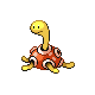

  

  

    

      
Types

      

        
        
      

    

    

      
Abilities

      

        <a href='' title="When this Pokemon is at full HP, any hit that would knock it out will instead leave it with 1 HP.  Regardless of its current HP, it is also immune to the one-hit KO moves: fissure, guillotine, horn drill, and sheer cold.  If this Pokemon is holding a focus sash, this ability takes precedence and the item will not be consumed.">Sturdy</a>
        /<a href='' title="This Pokemon eats any held Berry triggered by low HP when it falls below 50% of its HP, regardless of the Berry's usual threshold.">Gluttony</a>
      

    

  

## Base Stats
<table style="width: 100%">
  <tbody style="width: 100%;">
    <tr style="display: flex; align-items: center;">
      <th style="color: #737373;" >HP</th>
      <td style="border-top: none; width: 70px">20</td>
      <td style="width: 100%; min-width: 450px; border-top: none;">
        

        

      </td>
    </tr>
    <tr style="display: flex; align-items: center;">
      <th style="color: #737373;">Attack</th>
      <td style="border-top: none; width: 70px">10</td>
      <td style="width: 100%; min-width: 450px; border-top: none;">
        

        

      </td>
    </tr>
    <tr style="display: flex; align-items: center;">
      <th style="color: #737373;">Defense</th>
      <td style="border-top: none; width: 70px">230</td>
      <td style="width: 100%; min-width: 450px; border-top: none;">
        

        

      </td>
    </tr>
    <tr style="display: flex; align-items: center;">
      <th style="color: #737373;">SP Attack</th>
      <td style="border-top: none; width: 70px">10</td>
      <td style="width: 100%; min-width: 450px; border-top: none;">
        

        

      </td>
    </tr>
    <tr style="display: flex; align-items: center;">
      <th style="color: #737373;">SP Defense</th>
      <td style="border-top: none; width: 70px">230</td>
      <td style="width: 100%; min-width: 450px; border-top: none;">
        

        

      </td>
    </tr>
    <tr style="display: flex; align-items: center;">
      <th style="color: #737373;">Speed</th>
      <td style="border-top: none; width: 70px">5</td>
      <td style="width: 100%; min-width: 450px; border-top: none;">
        

        

      </td>
    </tr>
  </tbody>
</table>

## Moveset

=== "Level Up Moves"
    | Level | Name | Power | Accuracy | PP | Type | Damage Class |
        | -- | -- | -- | -- | -- | -- | -- |
        	| 1 | Constrict | 10 | 100 | 35 |  |  |
	| 1 | Withdraw | - | - | 40 |  |  |
	| 1 | Bide | - | - | 10 |  |  |
	| 1 | Rollout | 30 | 90 | 20 |  |  |
	| 5 | Encore | - | 100 | 5 |  |  |
	| 9 | Wrap | 15 | 90 | 20 |  |  |
	| 12 | Struggle-bug | 50 | 100 | 20 |  |  |
	| 23 | Rock-throw | 50 | 90 | 15 |  |  |
	| 27 | Gastro-acid | - | 100 | 10 |  |  |
	| 31 | Power-trick | - | - | 10 |  |  |
	| 34 | Shell-smash | - | - | 15 |  |  |
	| 42 | Bug-bite | 60 | 100 | 20 |  |  |
	| 45 | Power-split | - | - | 10 |  |  |
	| 45 | Guard-split | - | - | 10 |  |  |
	| 53 | Sticky-web | - | - | 20 |  |  |

        

=== "Machine Moves"
    | Machine | Name | Power | Accuracy | PP | Type | Damage Class |
        | -- | -- | -- | -- | -- | -- | -- |
        	| TM22 | Rock-slide | 75 | 90 | 10 |  |  |
	| TM27 | Toxic | - | 90 | 10 |  |  |
	| TM100 | Confide | - | - | 20 |  |  |
	| TM27 | Return | - | 100 | 20 |  |  |
	| TM87 | Swagger | - | 85 | 15 |  |  |
	| TM09 | Venoshock | 65 | 100 | 10 |  |  |
	| TM23 | Smack-down | 50 | 100 | 15 |  |  |
	| TM05 | Rest | - | - | 5 |  |  |
	| TM36 | Sludge-bomb | 90 | 100 | 10 |  |  |
	| TM41 | Earthquake | 100 | 100 | 10 |  |  |
	| TM88 | Sleep-talk | - | - | 10 |  |  |
	| TM32 | Double-team | - | - | 15 |  |  |
	| TM39 | Rock-tomb | 60 | 95 | 15 |  |  |
	| TM69 | Rock-polish | - | - | 20 |  |  |
	| TM34 | Sludge-wave | 95 | 100 | 10 |  |  |
	| TM10 | Hidden-power | 60 | 100 | 15 |  |  |
	| TM21 | Frustration | - | 100 | 20 |  |  |
	| TM78 | Bulldoze | 60 | 100 | 20 |  |  |
	| TM83 | Infestation | 20 | 100 | 20 |  |  |
	| TM74 | Gyro-ball | - | 100 | 5 |  |  |
	| TM45 | Attract | - | 100 | 15 |  |  |
	| TM37 | Sandstorm | - | - | 10 |  |  |
	| TM71 | Stone-edge | 100 | 80 | 5 |  |  |
	| TM11 | Sunny-day | - | - | 5 |  |  |
	| TM08 | Substitute | - | - | 10 |  |  |
	| TM20 | Safeguard | - | - | 25 |  |  |
	| TM07 | Protect | - | - | 10 |  |  |
	| TM12 | Facade | 70 | 100 | 20 |  |  |
	| TM48 | Round | 60 | 100 | 15 |  |  |

        
