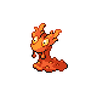

  

  

    

      
Types

      

        
        
      

    

    

      
Abilities

      

        <a href='' title="This Pokemon cannot be frozen.  If a Pokemon is frozen and acquires this ability, it will immediately thaw out; this includes when regaining a lost ability upon leaving battle.  Overworld: If any Pokemon in the party has this ability, each egg in the party has its hatch counter decreased by 2 (rather than 1) each step cycle, making eggs hatch roughly twice as quickly.  This effect does not stack if multiple Pokemon have this ability or flame body.">Magma-armor</a>
        /<a href='' title="Whenever a move makes contact with this Pokemon, the move's user has a 30% chance of being burned.  Overworld: If any Pokemon in the party has this ability, each egg in the party has its hatch counter decreased by 2 (rather than 1) each step cycle, making eggs hatch roughly twice as quickly.  This effect does not stack if multiple Pokemon have this ability or magma armor.">Flame-body</a>
      

    

  

## Base Stats
<table style="width: 100%">
  <tbody style="width: 100%;">
    <tr style="display: flex; align-items: center;">
      <th style="color: #737373;" >HP</th>
      <td style="border-top: none; width: 70px">40</td>
      <td style="width: 100%; min-width: 450px; border-top: none;">
        

        

      </td>
    </tr>
    <tr style="display: flex; align-items: center;">
      <th style="color: #737373;">Attack</th>
      <td style="border-top: none; width: 70px">40</td>
      <td style="width: 100%; min-width: 450px; border-top: none;">
        

        

      </td>
    </tr>
    <tr style="display: flex; align-items: center;">
      <th style="color: #737373;">Defense</th>
      <td style="border-top: none; width: 70px">40</td>
      <td style="width: 100%; min-width: 450px; border-top: none;">
        

        

      </td>
    </tr>
    <tr style="display: flex; align-items: center;">
      <th style="color: #737373;">SP Attack</th>
      <td style="border-top: none; width: 70px">70</td>
      <td style="width: 100%; min-width: 450px; border-top: none;">
        

        

      </td>
    </tr>
    <tr style="display: flex; align-items: center;">
      <th style="color: #737373;">SP Defense</th>
      <td style="border-top: none; width: 70px">40</td>
      <td style="width: 100%; min-width: 450px; border-top: none;">
        

        

      </td>
    </tr>
    <tr style="display: flex; align-items: center;">
      <th style="color: #737373;">Speed</th>
      <td style="border-top: none; width: 70px">20</td>
      <td style="width: 100%; min-width: 450px; border-top: none;">
        

        

      </td>
    </tr>
  </tbody>
</table>

## Moveset

=== "Level Up Moves"
    | Level | Name | Power | Accuracy | PP | Type | Damage Class |
        | -- | -- | -- | -- | -- | -- | -- |
        	| 1 | Smog | 30 | 70 | 20 |  |  |
	| 1 | Yawn | - | - | 10 |  |  |
	| 6 | Ember | 40 | 100 | 25 |  |  |
	| 8 | Rock-throw | 50 | 90 | 15 |  |  |
	| 13 | Harden | - | - | 30 |  |  |
	| 15 | Incinerate | 60 | 100 | 15 |  |  |
	| 20 | Clear-smog | 50 | - | 15 |  |  |
	| 22 | Ancient-power | 60 | 100 | 5 |  |  |
	| 27 | Flame-burst | 70 | 100 | 15 |  |  |
	| 34 | Lava-plume | 80 | 100 | 15 |  |  |
	| 36 | Amnesia | - | - | 20 |  |  |
	| 41 | Body-slam | 85 | 100 | 15 |  |  |
	| 43 | Recover | - | - | 5 |  |  |
	| 50 | Earth-power | 90 | 100 | 10 |  |  |

        

=== "Machine Moves"
    | Machine | Name | Power | Accuracy | PP | Type | Damage Class |
        | -- | -- | -- | -- | -- | -- | -- |
        	| TM22 | Rock-slide | 75 | 90 | 10 |  |  |
	| TM27 | Toxic | - | 90 | 10 |  |  |
	| TM100 | Confide | - | - | 20 |  |  |
	| TM27 | Return | - | 100 | 20 |  |  |
	| TM87 | Swagger | - | 85 | 15 |  |  |
	| TM05 | Rest | - | - | 5 |  |  |
	| TM61 | Will-o-wisp | - | 85 | 15 |  |  |
	| TM88 | Sleep-talk | - | - | 10 |  |  |
	| TM32 | Double-team | - | - | 15 |  |  |
	| TM39 | Rock-tomb | 60 | 95 | 15 |  |  |
	| TM38 | Fire-blast | 110 | 85 | 5 |  |  |
	| TM50 | Overheat | 130 | 90 | 5 |  |  |
	| TM43 | Flame-charge | 50 | 100 | 20 |  |  |
	| TM10 | Hidden-power | 60 | 100 | 15 |  |  |
	| TM21 | Frustration | - | 100 | 20 |  |  |
	| TM83 | Infestation | 20 | 100 | 20 |  |  |
	| TM45 | Attract | - | 100 | 15 |  |  |
	| TM11 | Sunny-day | - | - | 5 |  |  |
	| TM08 | Substitute | - | - | 10 |  |  |
	| TM16 | Light-screen | - | - | 30 |  |  |
	| TM07 | Protect | - | - | 10 |  |  |
	| TM12 | Facade | 70 | 100 | 20 |  |  |
	| TM96 | Nature-power | - | - | 20 |  |  |
	| TM48 | Round | 60 | 100 | 15 |  |  |
	| TM35 | Flamethrower | 90 | 100 | 15 |  |  |
	| TM33 | Reflect | - | - | 20 |  |  |

        
