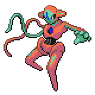

  

  

    

      
Types

      

        
        
      

    

    

      
Abilities

      

        <a href='' title="This Pokemon cannot have its stats lowered by other Pokemon.  This ability does not prevent any stat losses other than stat modifiers, such as the Speed cut from paralysis.  This Pokemon can still be passed negative stat modifiers through guard swap, heart swap, or power swap.  This ability functions identically to white smoke in battle.">Clear-body</a>
        
      

    

  

## Base Stats
<table style="width: 100%">
  <tbody style="width: 100%;">
    <tr style="display: flex; align-items: center;">
      <th style="color: #737373;" >HP</th>
      <td style="border-top: none; width: 70px">50</td>
      <td style="width: 100%; min-width: 450px; border-top: none;">
        

        

      </td>
    </tr>
    <tr style="display: flex; align-items: center;">
      <th style="color: #737373;">Attack</th>
      <td style="border-top: none; width: 70px">150</td>
      <td style="width: 100%; min-width: 450px; border-top: none;">
        

        

      </td>
    </tr>
    <tr style="display: flex; align-items: center;">
      <th style="color: #737373;">Defense</th>
      <td style="border-top: none; width: 70px">50</td>
      <td style="width: 100%; min-width: 450px; border-top: none;">
        

        

      </td>
    </tr>
    <tr style="display: flex; align-items: center;">
      <th style="color: #737373;">SP Attack</th>
      <td style="border-top: none; width: 70px">150</td>
      <td style="width: 100%; min-width: 450px; border-top: none;">
        

        

      </td>
    </tr>
    <tr style="display: flex; align-items: center;">
      <th style="color: #737373;">SP Defense</th>
      <td style="border-top: none; width: 70px">50</td>
      <td style="width: 100%; min-width: 450px; border-top: none;">
        

        

      </td>
    </tr>
    <tr style="display: flex; align-items: center;">
      <th style="color: #737373;">Speed</th>
      <td style="border-top: none; width: 70px">150</td>
      <td style="width: 100%; min-width: 450px; border-top: none;">
        

        

      </td>
    </tr>
  </tbody>
</table>

## Moveset

=== "Level Up Moves"
    | Level | Name | Power | Accuracy | PP | Type | Damage Class |
        | -- | -- | -- | -- | -- | -- | -- |
        	| 1 | Leer | - | 100 | 30 |  |  |
	| 1 | Wrap | 15 | 90 | 20 |  |  |
	| 13 | Teleport | - | - | 20 |  |  |
	| 13 | Double-team | - | - | 15 |  |  |
	| 37 | Superpower | 120 | 100 | 5 |  |  |
	| 55 | Cosmic-power | - | - | 20 |  |  |
	| 61 | Recover | - | - | 5 |  |  |
	| 61 | Zap-cannon | 120 | 50 | 5 |  |  |
	| 67 | Psycho-boost | 140 | 90 | 5 |  |  |
	| 73 | Mirror-coat | - | 100 | 20 |  |  |
	| 73 | Counter | - | 100 | 20 |  |  |
	| 73 | Extreme-speed | 80 | 100 | 5 |  |  |

        

=== "Machine Moves"
    | Machine | Name | Power | Accuracy | PP | Type | Damage Class |
        | -- | -- | -- | -- | -- | -- | -- |
        	| TM47 | Low-sweep | 65 | 100 | 20 |  |  |
	| TM22 | Rock-slide | 75 | 90 | 10 |  |  |
	| TM36 | Thunderbolt | 90 | 100 | 15 |  |  |
	| TM97 | Dark-pulse | 80 | 100 | 15 |  |  |
	| TM31 | Fire-punch | 75 | 100 | 15 |  |  |
	| TM39 | Swift | 60 | - | 20 |  |  |
	| TM05 | Rest | - | - | 5 |  |  |
	| TM56 | Fling | - | 100 | 10 |  |  |
	| TM84 | Poison-jab | 80 | 100 | 20 |  |  |
	| TR69 | Zen-headbutt | 80 | 90 | 15 |  |  |
	| TM38 | Thunder | 110 | 70 | 10 |  |  |
	| TM44 | Imprison | - | - | 10 |  |  |
	| TM04 | Calm-mind | - | - | 20 |  |  |
	| TM03 | Water-pulse | 60 | 100 | 20 |  |  |
	| TM88 | Sleep-talk | - | - | 10 |  |  |
	| TR68 | Nasty-plot | - | - | 20 |  |  |
	| TM60 | Drain-punch | 75 | 100 | 10 |  |  |
	| TM39 | Rock-tomb | 60 | 95 | 15 |  |  |
	| TM13 | Brick-break | 75 | 100 | 15 |  |  |
	| TM86 | Grass-knot | - | 100 | 20 |  |  |
	| TM16 | Icy-wind | 55 | 95 | 15 |  |  |
	| TM29 | Psychic | 90 | 100 | 10 |  |  |
	| TM35 | Ice-punch | 75 | 100 | 15 |  |  |
	| TR46 | Iron-defense | - | - | 15 |  |  |
	| TM56 | Stealth-rock | - | - | 20 |  |  |
	| TM92 | Trick-room | - | - | 5 |  |  |
	| TM48 | Skill-swap | - | - | 10 |  |  |
	| TM91 | Psychic-terrain | - | - | 10 |  |  |
	| TR17 | Amnesia | - | - | 20 |  |  |
	| TM30 | Shadow-ball | 80 | 100 | 15 |  |  |
	| TM53 | Energy-ball | 90 | 100 | 10 |  |  |
	| TR34 | Future-sight | 120 | 100 | 10 |  |  |
	| TM40 | Aerial-ace | 60 | - | 20 |  |  |
	| TR12 | Agility | - | - | 30 |  |  |
	| TM57 | Charge-beam | 50 | 90 | 10 |  |  |
	| TM26 | Scary-face | - | 100 | 10 |  |  |
	| TM45 | Solar-beam | 120 | 100 | 10 |  |  |
	| TM52 | Focus-blast | 120 | 70 | 5 |  |  |
	| TM55 | Ice-beam | 90 | 100 | 10 |  |  |
	| TM11 | Sunny-day | - | - | 5 |  |  |
	| TM54 | Flash-cannon | 80 | 100 | 10 |  |  |
	| TM08 | Substitute | - | - | 10 |  |  |
	| TM16 | Light-screen | - | - | 30 |  |  |
	| TM23 | Thunder-punch | 75 | 100 | 15 |  |  |
	| TM98 | Stomping-tantrum | 75 | 100 | 10 |  |  |
	| TM20 | Endure | - | - | 10 |  |  |
	| TR07 | Low-kick | - | 100 | 20 |  |  |
	| TM48 | Hyper-beam | 150 | 90 | 5 |  |  |
	| TM07 | Protect | - | - | 10 |  |  |
	| TM03 | Psyshock | 80 | 100 | 10 |  |  |
	| TM12 | Facade | 70 | 100 | 20 |  |  |
	| TM12 | Taunt | - | 100 | 20 |  |  |
	| TR95 | Throat-chop | 80 | 100 | 15 |  |  |
	| TM77 | Psych-up | - | - | 10 |  |  |
	| TR38 | Trick | - | 100 | 10 |  |  |
	| TR23 | Spikes | - | - | 20 |  |  |
	| TR82 | Stored-power | 20 | 100 | 10 |  |  |
	| TM18 | Rain-dance | - | - | 5 |  |  |
	| TM68 | Giga-impact | 150 | 90 | 5 |  |  |
	| TM33 | Reflect | - | - | 20 |  |  |
	| TM09 | Take-down | 90 | 85 | 20 |  |  |
	| TM16 | Thunder-wave | - | 90 | 20 |  |  |

        
