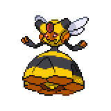

  

  

    

      
Types

      

        
        
      

    

    

      
Abilities

      

        <a href='' title="Moves targetting this Pokemon use one extra PP.  This ability stacks if multiple targets have it.  This ability still affects moves that fail or miss.  This ability does not affect ally moves that target either the entire field or just its side, nor this Pokemon's self-targetted moves; it does, however, affect single-targetted ally moves aimed at this Pokemon, ally moves that target all other Pokemon, and opponents' moves that target the entire field.  If this ability raises a move's PP cost above its remaining PP, it will use all remaining PP.  When this Pokemon enters battle, all participating trainers are notified that it has this ability.  Overworld: If the lead Pokemon has this ability, higher-levelled Pokemon have their encounter rate increased.">Pressure</a>
        /<a href='' title="Opposing Pokemon cannot eat held Berries while this Pokemon is in battle.  Affected Pokemon can still use bug bite or pluck to eat a target's Berry.">Unnerve</a>
      

    

  

## Base Stats
<table style="width: 100%">
  <tbody style="width: 100%;">
    <tr style="display: flex; align-items: center;">
      <th style="color: #737373;" >HP</th>
      <td style="border-top: none; width: 70px">70</td>
      <td style="width: 100%; min-width: 450px; border-top: none;">
        

        

      </td>
    </tr>
    <tr style="display: flex; align-items: center;">
      <th style="color: #737373;">Attack</th>
      <td style="border-top: none; width: 70px">80</td>
      <td style="width: 100%; min-width: 450px; border-top: none;">
        

        

      </td>
    </tr>
    <tr style="display: flex; align-items: center;">
      <th style="color: #737373;">Defense</th>
      <td style="border-top: none; width: 70px">102</td>
      <td style="width: 100%; min-width: 450px; border-top: none;">
        

        

      </td>
    </tr>
    <tr style="display: flex; align-items: center;">
      <th style="color: #737373;">SP Attack</th>
      <td style="border-top: none; width: 70px">80</td>
      <td style="width: 100%; min-width: 450px; border-top: none;">
        

        

      </td>
    </tr>
    <tr style="display: flex; align-items: center;">
      <th style="color: #737373;">SP Defense</th>
      <td style="border-top: none; width: 70px">102</td>
      <td style="width: 100%; min-width: 450px; border-top: none;">
        

        

      </td>
    </tr>
    <tr style="display: flex; align-items: center;">
      <th style="color: #737373;">Speed</th>
      <td style="border-top: none; width: 70px">40</td>
      <td style="width: 100%; min-width: 450px; border-top: none;">
        

        

      </td>
    </tr>
  </tbody>
</table>

## Moveset

=== "Level Up Moves"
    | Level | Name | Power | Accuracy | PP | Type | Damage Class |
        | -- | -- | -- | -- | -- | -- | -- |
        	| 1 | Poison-sting | 15 | 100 | 35 |  |  |
	| 1 | Gust | 40 | 100 | 35 |  |  |
	| 1 | Confuse-ray | - | 100 | 10 |  |  |
	| 1 | Sweet-scent | - | 100 | 20 |  |  |
	| 1 | Slash | 70 | 100 | 20 |  |  |
	| 5 | Fury-cutter | 40 | 95 | 20 |  |  |
	| 9 | Pursuit | 40 | 100 | 20 |  |  |
	| 13 | Fury-swipes | 18 | 80 | 15 |  |  |
	| 17 | Defend-order | - | - | 10 |  |  |
	| 25 | Power-gem | 80 | 100 | 20 |  |  |
	| 29 | Heal-order | - | - | 10 |  |  |
	| 37 | Air-slash | 75 | 95 | 15 |  |  |
	| 41 | Captivate | - | 100 | 20 |  |  |
	| 45 | Attack-order | 90 | 100 | 15 |  |  |
	| 53 | Destiny-bond | - | - | 5 |  |  |
	| 57 | Fell-stinger | 50 | 100 | 25 |  |  |

        

=== "Machine Moves"
    | Machine | Name | Power | Accuracy | PP | Type | Damage Class |
        | -- | -- | -- | -- | -- | -- | -- |
        	| TM27 | Toxic | - | 90 | 10 |  |  |
	| TM100 | Confide | - | - | 20 |  |  |
	| TM27 | Return | - | 100 | 20 |  |  |
	| TM87 | Swagger | - | 85 | 15 |  |  |
	| TM09 | Venoshock | 65 | 100 | 10 |  |  |
	| TM05 | Rest | - | - | 5 |  |  |
	| TM56 | Fling | - | 100 | 10 |  |  |
	| TM36 | Sludge-bomb | 90 | 100 | 10 |  |  |
	| TM62 | Acrobatics | 55 | 100 | 15 |  |  |
	| TM88 | Sleep-talk | - | - | 10 |  |  |
	| TM32 | Double-team | - | - | 15 |  |  |
	| TM46 | Thief | 60 | 100 | 25 |  |  |
	| TM89 | U-turn | 70 | 100 | 20 |  |  |
	| TM10 | Hidden-power | 60 | 100 | 15 |  |  |
	| TM21 | Frustration | - | 100 | 20 |  |  |
	| TM19 | Roost | - | - | 5 |  |  |
	| TM40 | Aerial-ace | 60 | - | 20 |  |  |
	| TM83 | Infestation | 20 | 100 | 20 |  |  |
	| TM45 | Attract | - | 100 | 15 |  |  |
	| TM11 | Sunny-day | - | - | 5 |  |  |
	| TM08 | Substitute | - | - | 10 |  |  |
	| TM48 | Hyper-beam | 150 | 90 | 5 |  |  |
	| TM07 | Protect | - | - | 10 |  |  |
	| TM12 | Facade | 70 | 100 | 20 |  |  |
	| TM81 | X-scissor | 80 | 100 | 15 |  |  |
	| TM48 | Round | 60 | 100 | 15 |  |  |
	| TM60 | Quash | - | 100 | 15 |  |  |
	| TM18 | Rain-dance | - | - | 5 |  |  |
	| TM68 | Giga-impact | 150 | 90 | 5 |  |  |

        
