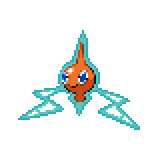

  

  

    

      
Types

      

        
        
      

    

    

      
Abilities

      

        <a href='' title="This Pokemon is immune to ground-type moves, spikes, toxic spikes, and arena trap.  This ability is disabled during gravity or ingrain, or while holding an iron ball.  This ability is not disabled during roost.">Levitate</a>
        /<a href='' title="This Pokemon is immune to ground-type moves, spikes, toxic spikes, and arena trap.  This ability is disabled during gravity or ingrain, or while holding an iron ball.  This ability is not disabled during roost.">Levitate</a>
      

    

  

## Base Stats
<table style="width: 100%">
  <tbody style="width: 100%;">
    <tr style="display: flex; align-items: center;">
      <th style="color: #737373;" >HP</th>
      <td style="border-top: none; width: 70px">50</td>
      <td style="width: 100%; min-width: 450px; border-top: none;">
        

        

      </td>
    </tr>
    <tr style="display: flex; align-items: center;">
      <th style="color: #737373;">Attack</th>
      <td style="border-top: none; width: 70px">50</td>
      <td style="width: 100%; min-width: 450px; border-top: none;">
        

        

      </td>
    </tr>
    <tr style="display: flex; align-items: center;">
      <th style="color: #737373;">Defense</th>
      <td style="border-top: none; width: 70px">77</td>
      <td style="width: 100%; min-width: 450px; border-top: none;">
        

        

      </td>
    </tr>
    <tr style="display: flex; align-items: center;">
      <th style="color: #737373;">SP Attack</th>
      <td style="border-top: none; width: 70px">95</td>
      <td style="width: 100%; min-width: 450px; border-top: none;">
        

        

      </td>
    </tr>
    <tr style="display: flex; align-items: center;">
      <th style="color: #737373;">SP Defense</th>
      <td style="border-top: none; width: 70px">77</td>
      <td style="width: 100%; min-width: 450px; border-top: none;">
        

        

      </td>
    </tr>
    <tr style="display: flex; align-items: center;">
      <th style="color: #737373;">Speed</th>
      <td style="border-top: none; width: 70px">91</td>
      <td style="width: 100%; min-width: 450px; border-top: none;">
        

        

      </td>
    </tr>
  </tbody>
</table>

## Locations
| Route | Area | Encounter Rate | Extra Instructions |
        | -- | -- | -- | -- |
        	| Vinview Town | Special | 100 |  |

        

## Moveset

=== "Level Up Moves"
    | Level | Name | Power | Accuracy | PP | Type | Damage Class |
        | -- | -- | -- | -- | -- | -- | -- |
        	| 1 | Astonish | 30 | 100 | 15 |  |  |
	| 1 | Double-team | - | - | 15 |  |  |
	| 5 | Thunder-shock | 40 | 100 | 30 |  |  |
	| 15 | Charge | - | - | 20 |  |  |
	| 30 | Shock-wave | 60 | - | 20 |  |  |
	| 50 | Discharge | 80 | 100 | 15 |  |  |
	| 55 | Uproar | 90 | 100 | 10 |  |  |

        

=== "Machine Moves"
    | Machine | Name | Power | Accuracy | PP | Type | Damage Class |
        | -- | -- | -- | -- | -- | -- | -- |
        	| TM36 | Thunderbolt | 90 | 100 | 15 |  |  |
	| TM93 | Eerie-impulse | - | 100 | 15 |  |  |
	| TM21 | Foul-play | 95 | 100 | 15 |  |  |
	| TM97 | Dark-pulse | 80 | 100 | 15 |  |  |
	| TM39 | Swift | 60 | - | 20 |  |  |
	| TM05 | Rest | - | - | 5 |  |  |
	| TM38 | Thunder | 110 | 70 | 10 |  |  |
	| TM61 | Will-o-wisp | - | 85 | 15 |  |  |
	| TM88 | Sleep-talk | - | - | 10 |  |  |
	| TR68 | Nasty-plot | - | - | 20 |  |  |
	| TM46 | Thief | 60 | 100 | 25 |  |  |
	| TR80 | Electro-ball | - | 100 | 10 |  |  |
	| TM03 | Helping-hand | - | - | 20 |  |  |
	| TM30 | Shadow-ball | 80 | 100 | 15 |  |  |
	| TM90 | Electric-terrain | - | - | 10 |  |  |
	| TM57 | Charge-beam | 50 | 90 | 10 |  |  |
	| TM77 | Hex | 65 | 100 | 10 |  |  |
	| TM11 | Sunny-day | - | - | 5 |  |  |
	| TM08 | Substitute | - | - | 10 |  |  |
	| TM16 | Light-screen | - | - | 30 |  |  |
	| TM72 | Volt-switch | 70 | 100 | 20 |  |  |
	| TM20 | Endure | - | - | 10 |  |  |
	| TR42 | Hyper-voice | 90 | 100 | 10 |  |  |
	| TM07 | Protect | - | - | 10 |  |  |
	| TM12 | Facade | 70 | 100 | 20 |  |  |
	| TR38 | Trick | - | 100 | 10 |  |  |
	| TR82 | Stored-power | 20 | 100 | 10 |  |  |
	| TM18 | Rain-dance | - | - | 5 |  |  |
	| TM33 | Reflect | - | - | 20 |  |  |
	| TM16 | Thunder-wave | - | 90 | 20 |  |  |

        
