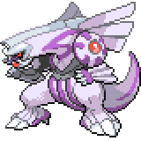

  

  

    

      
Types

      

        
        
      

    

    

      
Abilities

      

        <a href='' title="This Pokemon cannot have its stats lowered by other Pokemon.  This ability does not prevent any stat losses other than stat modifiers, such as the Speed cut from paralysis.  This Pokemon can still be passed negative stat modifiers through guard swap, heart swap, or power swap.  This ability functions identically to white smoke in battle.">Clear-body</a>
        /<a href='' title="This Pokemon's moves completely ignore abilities that could hinder or prevent their effect on the target.  For example, this Pokemon's moves ignore abilities that would fully negate them, such as water absorb; abilities that would prevent any of their effects, such as clear body, shell armor, or sticky hold; and abilities that grant any general protective benefit, such as simple, snow cloak, or thick fat.  If an ability could either hinder or help this Pokemon's moves, e.g. dry skin or unaware, the ability is ignored either way.  Abilities that do not fit this description, even if they could hinder moves in some other way, are not affected.  For example, cursed body only affects potential future uses of the move, while liquid ooze and shadow tag can only hinder a move's effect on the user.  This ablity cannot ignore type or form changes granted by abilities, for example color change or forecast; nor effects that were caused by abilities but are no longer tied to an ability, such as the rain from drizzle.  This ability cannot ignore multitype at all.  An ability ignored by this ability is only nullified while the move is being used.  For example, this Pokemon's moves can paralyze a Pokemon with limber, but Limber will activate and heal the paralysis immediately thereafter, and this Pokemon's spikes are not affected by this ability after they have been placed.  When this Pokemon enters battle, all participating trainers are notified that it has this ability.  This ability functions identically to teravolt and turboblaze.">Mold-breaker</a>
      

    

  

## Base Stats
<table style="width: 100%">
  <tbody style="width: 100%;">
    <tr style="display: flex; align-items: center;">
      <th style="color: #737373;" >HP</th>
      <td style="border-top: none; width: 70px">90</td>
      <td style="width: 100%; min-width: 450px; border-top: none;">
        

        

      </td>
    </tr>
    <tr style="display: flex; align-items: center;">
      <th style="color: #737373;">Attack</th>
      <td style="border-top: none; width: 70px">120</td>
      <td style="width: 100%; min-width: 450px; border-top: none;">
        

        

      </td>
    </tr>
    <tr style="display: flex; align-items: center;">
      <th style="color: #737373;">Defense</th>
      <td style="border-top: none; width: 70px">100</td>
      <td style="width: 100%; min-width: 450px; border-top: none;">
        

        

      </td>
    </tr>
    <tr style="display: flex; align-items: center;">
      <th style="color: #737373;">SP Attack</th>
      <td style="border-top: none; width: 70px">150</td>
      <td style="width: 100%; min-width: 450px; border-top: none;">
        

        

      </td>
    </tr>
    <tr style="display: flex; align-items: center;">
      <th style="color: #737373;">SP Defense</th>
      <td style="border-top: none; width: 70px">120</td>
      <td style="width: 100%; min-width: 450px; border-top: none;">
        

        

      </td>
    </tr>
    <tr style="display: flex; align-items: center;">
      <th style="color: #737373;">Speed</th>
      <td style="border-top: none; width: 70px">100</td>
      <td style="width: 100%; min-width: 450px; border-top: none;">
        

        

      </td>
    </tr>
  </tbody>
</table>

## Moveset

=== "Level Up Moves"
    | Level | Name | Power | Accuracy | PP | Type | Damage Class |
        | -- | -- | -- | -- | -- | -- | -- |
        	| 8 | Dragon-breath | 60 | 100 | 20 |  |  |
	| 16 | Ancient-power | 60 | 100 | 5 |  |  |
	| 24 | Slash | 70 | 100 | 20 |  |  |
	| 32 | Aqua-ring | - | - | 20 |  |  |
	| 64 | Aqua-tail | 90 | 90 | 10 |  |  |
	| 80 | Spacial-rend | 100 | 95 | 5 |  |  |

        

=== "Machine Moves"
    | Machine | Name | Power | Accuracy | PP | Type | Damage Class |
        | -- | -- | -- | -- | -- | -- | -- |
        	| TM22 | Rock-slide | 75 | 90 | 10 |  |  |
	| TM36 | Thunderbolt | 90 | 100 | 15 |  |  |
	| TM08 | Bulk-up | - | - | 20 |  |  |
	| TM39 | Swift | 60 | - | 20 |  |  |
	| TM05 | Rest | - | - | 5 |  |  |
	| TM56 | Fling | - | 100 | 10 |  |  |
	| TR67 | Earth-power | 90 | 100 | 10 |  |  |
	| TM38 | Thunder | 110 | 70 | 10 |  |  |
	| TM41 | Earthquake | 100 | 100 | 10 |  |  |
	| TR98 | Liquidation | 85 | 100 | 10 |  |  |
	| TM08 | Body-slam | 85 | 100 | 15 |  |  |
	| TM03 | Water-pulse | 60 | 100 | 20 |  |  |
	| TM88 | Sleep-talk | - | - | 10 |  |  |
	| TM65 | Shadow-claw | 70 | 100 | 15 |  |  |
	| TM39 | Rock-tomb | 60 | 95 | 15 |  |  |
	| TM13 | Brick-break | 75 | 100 | 15 |  |  |
	| TR03 | Hydro-pump | 110 | 80 | 5 |  |  |
	| TM38 | Fire-blast | 110 | 85 | 5 |  |  |
	| TM16 | Icy-wind | 55 | 95 | 15 |  |  |
	| TR99 | Body-press | 80 | 100 | 10 |  |  |
	| TM92 | Trick-room | - | - | 5 |  |  |
	| TR56 | Aura-sphere | 80 | - | 20 |  |  |
	| TM40 | Aerial-ace | 60 | - | 20 |  |  |
	| TM78 | Bulldoze | 60 | 100 | 20 |  |  |
	| TM26 | Scary-face | - | 100 | 10 |  |  |
	| TM37 | Sandstorm | - | - | 10 |  |  |
	| TM71 | Stone-edge | 100 | 80 | 5 |  |  |
	| TM82 | Dragon-tail | 60 | 90 | 10 |  |  |
	| TM52 | Focus-blast | 120 | 70 | 5 |  |  |
	| TM55 | Ice-beam | 90 | 100 | 10 |  |  |
	| TM02 | Dragon-claw | 80 | 100 | 15 |  |  |
	| TM11 | Sunny-day | - | - | 5 |  |  |
	| TM08 | Substitute | - | - | 10 |  |  |
	| TM98 | Stomping-tantrum | 75 | 100 | 10 |  |  |
	| TM20 | Endure | - | - | 10 |  |  |
	| TM39 | Outrage | 120 | 100 | 10 |  |  |
	| TR42 | Hyper-voice | 90 | 100 | 10 |  |  |
	| TM48 | Hyper-beam | 150 | 90 | 5 |  |  |
	| TM07 | Protect | - | - | 10 |  |  |
	| TR63 | Power-gem | 80 | 100 | 20 |  |  |
	| TM12 | Facade | 70 | 100 | 20 |  |  |
	| TR38 | Trick | - | 100 | 10 |  |  |
	| TM14 | Blizzard | 110 | 70 | 5 |  |  |
	| TM18 | Rain-dance | - | - | 5 |  |  |
	| TM68 | Giga-impact | 150 | 90 | 5 |  |  |
	| TM34 | Dragon-pulse | 85 | 100 | 10 |  |  |
	| TR79 | Heavy-slam | - | 100 | 10 |  |  |
	| TM35 | Flamethrower | 90 | 100 | 15 |  |  |
	| TM98 | Waterfall | 80 | 100 | 15 |  |  |
	| TM09 | Take-down | 90 | 85 | 20 |  |  |
	| TM64 | Avalanche | 60 | 100 | 10 |  |  |
	| TM16 | Thunder-wave | - | 90 | 20 |  |  |
	| TM94 | Surf | 90 | 100 | 15 |  |  |

        
