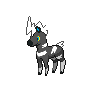

  

  

    

      
Types

      

        
        
      

    

    

      
Abilities

      

        <a href='' title="All other Pokemon's single-target electric-type moves are redirected to this Pokemon if it is an eligible target.  Other Pokemon's Electric moves raise this Pokemon's Special Attack one stage, negating any other effect on it, and cannot miss it.  If the move's intended target also has this ability, the move is not redirected.  When multiple Pokemon with this ability are possible targets for redirection, the move is redirected to the one with the highest Speed stat, or, in the case of a tie, to a random tied Pokemon.  follow me takes precedence over this ability.  If the Pokemon is a ground-type and thus immune to Electric moves, its immunity prevents the Special Attack boost.">Lightning-rod</a>
        /<a href='' title="Whenever an electric-type move hits this Pokemon, its Speed rises one stage, negating any other effect on it.  This ability will not take effect if this Pokemon is immune to Electric moves.  Electric moves will ignore this Pokemon's substitute.  This effect includes non-damaging moves, i.e. thunder wave.">Motor-drive</a>
      

    

  

## Base Stats
<table style="width: 100%">
  <tbody style="width: 100%;">
    <tr style="display: flex; align-items: center;">
      <th style="color: #737373;" >HP</th>
      <td style="border-top: none; width: 70px">45</td>
      <td style="width: 100%; min-width: 450px; border-top: none;">
        

        

      </td>
    </tr>
    <tr style="display: flex; align-items: center;">
      <th style="color: #737373;">Attack</th>
      <td style="border-top: none; width: 70px">60</td>
      <td style="width: 100%; min-width: 450px; border-top: none;">
        

        

      </td>
    </tr>
    <tr style="display: flex; align-items: center;">
      <th style="color: #737373;">Defense</th>
      <td style="border-top: none; width: 70px">32</td>
      <td style="width: 100%; min-width: 450px; border-top: none;">
        

        

      </td>
    </tr>
    <tr style="display: flex; align-items: center;">
      <th style="color: #737373;">SP Attack</th>
      <td style="border-top: none; width: 70px">50</td>
      <td style="width: 100%; min-width: 450px; border-top: none;">
        

        

      </td>
    </tr>
    <tr style="display: flex; align-items: center;">
      <th style="color: #737373;">SP Defense</th>
      <td style="border-top: none; width: 70px">32</td>
      <td style="width: 100%; min-width: 450px; border-top: none;">
        

        

      </td>
    </tr>
    <tr style="display: flex; align-items: center;">
      <th style="color: #737373;">Speed</th>
      <td style="border-top: none; width: 70px">76</td>
      <td style="width: 100%; min-width: 450px; border-top: none;">
        

        

      </td>
    </tr>
  </tbody>
</table>

## Moveset

=== "Level Up Moves"
    | Level | Name | Power | Accuracy | PP | Type | Damage Class |
        | -- | -- | -- | -- | -- | -- | -- |
        	| 1 | Quick-attack | 40 | 100 | 30 |  |  |
	| 4 | Tail-whip | - | 100 | 30 |  |  |
	| 8 | Charge | - | - | 20 |  |  |
	| 11 | Shock-wave | 60 | - | 20 |  |  |
	| 22 | Pursuit | 40 | 100 | 20 |  |  |
	| 25 | Spark | 65 | 100 | 20 |  |  |
	| 29 | Stomp | 65 | 100 | 20 |  |  |
	| 32 | Discharge | 80 | 100 | 15 |  |  |
	| 36 | Agility | - | - | 30 |  |  |
	| 43 | Thrash | 120 | 100 | 10 |  |  |

        

=== "Machine Moves"
    | Machine | Name | Power | Accuracy | PP | Type | Damage Class |
        | -- | -- | -- | -- | -- | -- | -- |
        	| TM27 | Toxic | - | 90 | 10 |  |  |
	| TM36 | Thunderbolt | 90 | 100 | 15 |  |  |
	| TM100 | Confide | - | - | 20 |  |  |
	| TM27 | Return | - | 100 | 20 |  |  |
	| TM87 | Swagger | - | 85 | 15 |  |  |
	| TM05 | Rest | - | - | 5 |  |  |
	| TM38 | Thunder | 110 | 70 | 10 |  |  |
	| TM88 | Sleep-talk | - | - | 10 |  |  |
	| TM32 | Double-team | - | - | 15 |  |  |
	| TM43 | Flame-charge | 50 | 100 | 20 |  |  |
	| TM10 | Hidden-power | 60 | 100 | 15 |  |  |
	| TM21 | Frustration | - | 100 | 20 |  |  |
	| TM57 | Charge-beam | 50 | 90 | 10 |  |  |
	| TM45 | Attract | - | 100 | 15 |  |  |
	| TM08 | Substitute | - | - | 10 |  |  |
	| TM16 | Light-screen | - | - | 30 |  |  |
	| TM72 | Volt-switch | 70 | 100 | 20 |  |  |
	| TM93 | Wild-charge | 90 | 100 | 15 |  |  |
	| TM07 | Protect | - | - | 10 |  |  |
	| TM12 | Facade | 70 | 100 | 20 |  |  |
	| TM48 | Round | 60 | 100 | 15 |  |  |
	| TM18 | Rain-dance | - | - | 5 |  |  |
	| TM16 | Thunder-wave | - | 90 | 20 |  |  |

        
