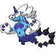

  

  

    

      
Types

      

        
        
      

    

    

      
Abilities

      

        <a href='' title="This Pokemon's non-damaging moves have their priority increased by one stage.">Prankster</a>
        /<a href='' title="When any of this Pokemon's stats are lowered, its Attack rises by two stages.  If multiple stats are lowered at once, this ability takes effect with each stat lowered.">Defiant</a>
      

    

  

## Base Stats
<table style="width: 100%">
  <tbody style="width: 100%;">
    <tr style="display: flex; align-items: center;">
      <th style="color: #737373;" >HP</th>
      <td style="border-top: none; width: 70px">79</td>
      <td style="width: 100%; min-width: 450px; border-top: none;">
        

        

      </td>
    </tr>
    <tr style="display: flex; align-items: center;">
      <th style="color: #737373;">Attack</th>
      <td style="border-top: none; width: 70px">105</td>
      <td style="width: 100%; min-width: 450px; border-top: none;">
        

        

      </td>
    </tr>
    <tr style="display: flex; align-items: center;">
      <th style="color: #737373;">Defense</th>
      <td style="border-top: none; width: 70px">70</td>
      <td style="width: 100%; min-width: 450px; border-top: none;">
        

        

      </td>
    </tr>
    <tr style="display: flex; align-items: center;">
      <th style="color: #737373;">SP Attack</th>
      <td style="border-top: none; width: 70px">145</td>
      <td style="width: 100%; min-width: 450px; border-top: none;">
        

        

      </td>
    </tr>
    <tr style="display: flex; align-items: center;">
      <th style="color: #737373;">SP Defense</th>
      <td style="border-top: none; width: 70px">80</td>
      <td style="width: 100%; min-width: 450px; border-top: none;">
        

        

      </td>
    </tr>
    <tr style="display: flex; align-items: center;">
      <th style="color: #737373;">Speed</th>
      <td style="border-top: none; width: 70px">101</td>
      <td style="width: 100%; min-width: 450px; border-top: none;">
        

        

      </td>
    </tr>
  </tbody>
</table>

## Moveset

=== "Level Up Moves"
    | Level | Name | Power | Accuracy | PP | Type | Damage Class |
        | -- | -- | -- | -- | -- | -- | -- |
        	| 1 | Astonish | 30 | 100 | 15 |  |  |
	| 1 | Thunder-shock | 40 | 100 | 30 |  |  |
	| 5 | Leer | - | 100 | 30 |  |  |
	| 10 | Swagger | - | 85 | 15 |  |  |
	| 15 | Bite | 60 | 100 | 25 |  |  |
	| 20 | Shock-wave | 60 | - | 20 |  |  |
	| 30 | Charge | - | - | 20 |  |  |
	| 45 | Discharge | 80 | 100 | 15 |  |  |
	| 50 | Uproar | 90 | 100 | 10 |  |  |
	| 55 | Hammer-arm | 100 | 90 | 10 |  |  |
	| 70 | Thrash | 120 | 100 | 10 |  |  |
	| 75 | Wildbolt-storm | 100 | 80 | 10 |  |  |

        

=== "Machine Moves"
    | Machine | Name | Power | Accuracy | PP | Type | Damage Class |
        | -- | -- | -- | -- | -- | -- | -- |
        	| TM36 | Thunderbolt | 90 | 100 | 15 |  |  |
	| TM93 | Eerie-impulse | - | 100 | 15 |  |  |
	| TM08 | Bulk-up | - | - | 20 |  |  |
	| TM21 | Foul-play | 95 | 100 | 15 |  |  |
	| TM97 | Dark-pulse | 80 | 100 | 15 |  |  |
	| TM05 | Rest | - | - | 5 |  |  |
	| TM56 | Fling | - | 100 | 10 |  |  |
	| TM36 | Sludge-bomb | 90 | 100 | 10 |  |  |
	| TM62 | Acrobatics | 55 | 100 | 15 |  |  |
	| TR69 | Zen-headbutt | 80 | 90 | 15 |  |  |
	| TM38 | Thunder | 110 | 70 | 10 |  |  |
	| TM67 | Smart-strike | 70 | - | 10 |  |  |
	| TM08 | Body-slam | 85 | 100 | 15 |  |  |
	| TM88 | Sleep-talk | - | - | 10 |  |  |
	| TR68 | Nasty-plot | - | - | 20 |  |  |
	| TM46 | Thief | 60 | 100 | 25 |  |  |
	| TR80 | Electro-ball | - | 100 | 10 |  |  |
	| TM89 | U-turn | 70 | 100 | 20 |  |  |
	| TM13 | Brick-break | 75 | 100 | 15 |  |  |
	| TM86 | Grass-knot | - | 100 | 20 |  |  |
	| TM29 | Psychic | 90 | 100 | 10 |  |  |
	| TR12 | Agility | - | - | 30 |  |  |
	| TM90 | Electric-terrain | - | - | 10 |  |  |
	| TM57 | Charge-beam | 50 | 90 | 10 |  |  |
	| TM26 | Scary-face | - | 100 | 10 |  |  |
	| TR32 | Crunch | 80 | 100 | 15 |  |  |
	| TM95 | Snarl | 55 | 95 | 15 |  |  |
	| TM52 | Focus-blast | 120 | 70 | 5 |  |  |
	| TM11 | Sunny-day | - | - | 5 |  |  |
	| TM54 | Flash-cannon | 80 | 100 | 10 |  |  |
	| TM08 | Substitute | - | - | 10 |  |  |
	| TM72 | Volt-switch | 70 | 100 | 20 |  |  |
	| TM136 | Thunder-punch | 75 | 100 | 15 |  |  |
	| TM93 | Wild-charge | 90 | 100 | 15 |  |  |
	| TM20 | Endure | - | - | 10 |  |  |
	| TM48 | Hyper-beam | 150 | 90 | 5 |  |  |
	| TM07 | Protect | - | - | 10 |  |  |
	| TM12 | Facade | 70 | 100 | 20 |  |  |
	| TM12 | Taunt | - | 100 | 20 |  |  |
	| TM76 | Fly | 90 | 95 | 15 |  |  |
	| TM18 | Rain-dance | - | - | 5 |  |  |
	| TM68 | Giga-impact | 150 | 90 | 5 |  |  |
	| TM09 | Take-down | 90 | 85 | 20 |  |  |
	| TM16 | Thunder-wave | - | 90 | 20 |  |  |

        
