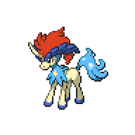

  

  

    

      
Types

      

        
        
      

    

    

      
Abilities

      

        <a href='' title="Whenever a dark-type move hits this Pokemon, its Attack rises one stage.  The move is not negated in any way.">Justified</a>
        
      

    

  

## Base Stats
<table style="width: 100%">
  <tbody style="width: 100%;">
    <tr style="display: flex; align-items: center;">
      <th style="color: #737373;" >HP</th>
      <td style="border-top: none; width: 70px">91</td>
      <td style="width: 100%; min-width: 450px; border-top: none;">
        

        

      </td>
    </tr>
    <tr style="display: flex; align-items: center;">
      <th style="color: #737373;">Attack</th>
      <td style="border-top: none; width: 70px">72</td>
      <td style="width: 100%; min-width: 450px; border-top: none;">
        

        

      </td>
    </tr>
    <tr style="display: flex; align-items: center;">
      <th style="color: #737373;">Defense</th>
      <td style="border-top: none; width: 70px">90</td>
      <td style="width: 100%; min-width: 450px; border-top: none;">
        

        

      </td>
    </tr>
    <tr style="display: flex; align-items: center;">
      <th style="color: #737373;">SP Attack</th>
      <td style="border-top: none; width: 70px">129</td>
      <td style="width: 100%; min-width: 450px; border-top: none;">
        

        

      </td>
    </tr>
    <tr style="display: flex; align-items: center;">
      <th style="color: #737373;">SP Defense</th>
      <td style="border-top: none; width: 70px">90</td>
      <td style="width: 100%; min-width: 450px; border-top: none;">
        

        

      </td>
    </tr>
    <tr style="display: flex; align-items: center;">
      <th style="color: #737373;">Speed</th>
      <td style="border-top: none; width: 70px">108</td>
      <td style="width: 100%; min-width: 450px; border-top: none;">
        

        

      </td>
    </tr>
  </tbody>
</table>

## Moveset

=== "Level Up Moves"
    | Level | Name | Power | Accuracy | PP | Type | Damage Class |
        | -- | -- | -- | -- | -- | -- | -- |
        	| 1 | Leer | - | 100 | 30 |  |  |
	| 1 | Aqua-jet | 40 | 100 | 20 |  |  |
	| 1 | Secret-sword | 85 | 100 | 10 |  |  |
	| 1 | Work-up | - | - | 30 |  |  |
	| 7 | Bubble-beam | 65 | 100 | 20 |  |  |
	| 14 | Quick-guard | - | - | 15 |  |  |
	| 21 | Double-kick | 30 | 100 | 30 |  |  |
	| 28 | Retaliate | 70 | 100 | 5 |  |  |
	| 35 | Aqua-tail | 90 | 90 | 10 |  |  |
	| 49 | Sacred-sword | 90 | 100 | 15 |  |  |

        

=== "Machine Moves"
    | Machine | Name | Power | Accuracy | PP | Type | Damage Class |
        | -- | -- | -- | -- | -- | -- | -- |
        	| TM114 | Trailblaze | 50 | 100 | 20 |  |  |
	| TR45 | Muddy-water | 90 | 85 | 10 |  |  |
	| TM54 | False-swipe | 40 | 100 | 40 |  |  |
	| TM39 | Swift | 60 | - | 20 |  |  |
	| TM05 | Rest | - | - | 5 |  |  |
	| TM84 | Poison-jab | 80 | 100 | 20 |  |  |
	| TM115 | Chilling-water | 50 | 100 | 20 |  |  |
	| TM67 | Smart-strike | 70 | - | 10 |  |  |
	| TR98 | Liquidation | 85 | 100 | 10 |  |  |
	| TM04 | Calm-mind | - | - | 20 |  |  |
	| TM03 | Water-pulse | 60 | 100 | 20 |  |  |
	| TM88 | Sleep-talk | - | - | 10 |  |  |
	| TR21 | Reversal | - | 100 | 15 |  |  |
	| TM05 | Roar | - | - | 20 |  |  |
	| TM13 | Brick-break | 75 | 100 | 15 |  |  |
	| TR53 | Close-combat | 120 | 100 | 5 |  |  |
	| TR03 | Hydro-pump | 110 | 80 | 5 |  |  |
	| TM16 | Icy-wind | 55 | 95 | 15 |  |  |
	| TM95 | Air-slash | 75 | 95 | 15 |  |  |
	| TM03 | Helping-hand | - | - | 20 |  |  |
	| TR56 | Aura-sphere | 80 | - | 20 |  |  |
	| TM10 | Double-edge | 120 | 100 | 15 |  |  |
	| TM40 | Aerial-ace | 60 | - | 20 |  |  |
	| TM71 | Stone-edge | 100 | 80 | 5 |  |  |
	| TM52 | Focus-blast | 120 | 70 | 5 |  |  |
	| TM11 | Sunny-day | - | - | 5 |  |  |
	| TM08 | Substitute | - | - | 10 |  |  |
	| TM20 | Endure | - | - | 10 |  |  |
	| TR07 | Low-kick | - | 100 | 20 |  |  |
	| TM48 | Hyper-beam | 150 | 90 | 5 |  |  |
	| TM07 | Protect | - | - | 10 |  |  |
	| TM12 | Facade | 70 | 100 | 20 |  |  |
	| TM81 | X-scissor | 80 | 100 | 15 |  |  |
	| TM12 | Taunt | - | 100 | 20 |  |  |
	| TM77 | Psych-up | - | - | 10 |  |  |
	| TM18 | Rain-dance | - | - | 5 |  |  |
	| TM68 | Giga-impact | 150 | 90 | 5 |  |  |
	| TR29 | Baton-pass | - | - | 40 |  |  |
	| TM33 | Reflect | - | - | 20 |  |  |
	| TM09 | Take-down | 90 | 85 | 20 |  |  |
	| TM75 | Swords-dance | - | - | 20 |  |  |
	| TM94 | Surf | 90 | 100 | 15 |  |  |

        
