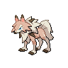

  

  

    

      
Types

      

        
        
      

    

    

      
Abilities

      

        <a href='' title="This Pokemon cannot have its accuracy lowered.  This ability does not prevent any accuracy losses other than stat modifiers, such as the accuracy cut from fog; nor does it prevent other Pokemon's evasion from making this Pokemon's moves less accurate.  This Pokemon can still be passed negative accuracy modifiers through heart swap.  Overworld: If the first Pokemon in the party has this ability, any random encounter with a Pokemon five or more levels lower than it has a 50% chance of being skipped.">Keen-eye</a>
        /<a href='' title="This Pokemon's Speed is doubled during a sandstorm, and it does not take sandstorm damage, regardless of type.">Sand-rush</a>
      

    

  

## Base Stats
<table style="width: 100%">
  <tbody style="width: 100%;">
    <tr style="display: flex; align-items: center;">
      <th style="color: #737373;" >HP</th>
      <td style="border-top: none; width: 70px">75</td>
      <td style="width: 100%; min-width: 450px; border-top: none;">
        

        

      </td>
    </tr>
    <tr style="display: flex; align-items: center;">
      <th style="color: #737373;">Attack</th>
      <td style="border-top: none; width: 70px">115</td>
      <td style="width: 100%; min-width: 450px; border-top: none;">
        

        

      </td>
    </tr>
    <tr style="display: flex; align-items: center;">
      <th style="color: #737373;">Defense</th>
      <td style="border-top: none; width: 70px">65</td>
      <td style="width: 100%; min-width: 450px; border-top: none;">
        

        

      </td>
    </tr>
    <tr style="display: flex; align-items: center;">
      <th style="color: #737373;">SP Attack</th>
      <td style="border-top: none; width: 70px">55</td>
      <td style="width: 100%; min-width: 450px; border-top: none;">
        

        

      </td>
    </tr>
    <tr style="display: flex; align-items: center;">
      <th style="color: #737373;">SP Defense</th>
      <td style="border-top: none; width: 70px">65</td>
      <td style="width: 100%; min-width: 450px; border-top: none;">
        

        

      </td>
    </tr>
    <tr style="display: flex; align-items: center;">
      <th style="color: #737373;">Speed</th>
      <td style="border-top: none; width: 70px">112</td>
      <td style="width: 100%; min-width: 450px; border-top: none;">
        

        

      </td>
    </tr>
  </tbody>
</table>

## Moveset

=== "Level Up Moves"
    | Level | Name | Power | Accuracy | PP | Type | Damage Class |
        | -- | -- | -- | -- | -- | -- | -- |
        	| 1 | Tackle | 40 | 100 | 35 |  |  |
	| 1 | Leer | - | 100 | 30 |  |  |
	| 1 | Double-team | - | - | 15 |  |  |
	| 1 | Accelerock | 40 | 100 | 20 |  |  |
	| 1 | Sucker-punch | 70 | 100 | 5 |  |  |
	| 1 | Quick-guard | - | - | 15 |  |  |
	| 1 | Counter | - | 100 | 20 |  |  |
	| 1 | Quick-attack | 40 | 100 | 30 |  |  |
	| 1 | Sand-attack | - | 100 | 15 |  |  |
	| 12 | Rock-throw | 50 | 90 | 15 |  |  |
	| 16 | Howl | - | - | 40 |  |  |
	| 20 | Bite | 60 | 100 | 25 |  |  |
	| 30 | Roar | - | - | 20 |  |  |

        

=== "Machine Moves"
    | Machine | Name | Power | Accuracy | PP | Type | Damage Class |
        | -- | -- | -- | -- | -- | -- | -- |
        	| TM47 | Low-sweep | 65 | 100 | 20 |  |  |
	| TM114 | Trailblaze | 50 | 100 | 20 |  |  |
	| TM22 | Rock-slide | 75 | 90 | 10 |  |  |
	| TM08 | Bulk-up | - | - | 20 |  |  |
	| TM21 | Foul-play | 95 | 100 | 15 |  |  |
	| TM54 | Rock-blast | 25 | 90 | 10 |  |  |
	| TM135 | Fire-punch | 75 | 100 | 15 |  |  |
	| TM39 | Swift | 60 | - | 20 |  |  |
	| TM05 | Rest | - | - | 5 |  |  |
	| TM56 | Fling | - | 100 | 10 |  |  |
	| TR67 | Earth-power | 90 | 100 | 10 |  |  |
	| TR74 | Iron-head | 80 | 100 | 15 |  |  |
	| TR69 | Zen-headbutt | 80 | 90 | 15 |  |  |
	| TM29 | Charm | - | 100 | 20 |  |  |
	| TM08 | Body-slam | 85 | 100 | 15 |  |  |
	| TM88 | Sleep-talk | - | - | 10 |  |  |
	| TM58 | Drill-run | 80 | 95 | 10 |  |  |
	| TR21 | Reversal | - | 100 | 15 |  |  |
	| TM65 | Shadow-claw | 70 | 100 | 15 |  |  |
	| TM39 | Rock-tomb | 60 | 95 | 15 |  |  |
	| TM130 | Thunder-fang | 65 | 95 | 15 |  |  |
	| TM13 | Brick-break | 75 | 100 | 15 |  |  |
	| TR53 | Close-combat | 120 | 100 | 5 |  |  |
	| TM10 | Dig | 80 | 100 | 10 |  |  |
	| TM31 | Mud-slap | 20 | 100 | 10 |  |  |
	| TR46 | Iron-defense | - | - | 15 |  |  |
	| TM56 | Stealth-rock | - | - | 20 |  |  |
	| TM03 | Helping-hand | - | - | 20 |  |  |
	| TM44 | Play-rough | 90 | 90 | 10 |  |  |
	| TR97 | Psychic-fangs | 85 | 100 | 10 |  |  |
	| TR12 | Agility | - | - | 30 |  |  |
	| TM78 | Bulldoze | 60 | 100 | 20 |  |  |
	| TM126 | Fire-fang | 65 | 95 | 15 |  |  |
	| TM26 | Scary-face | - | 100 | 10 |  |  |
	| TM37 | Sandstorm | - | - | 10 |  |  |
	| TR32 | Crunch | 80 | 100 | 15 |  |  |
	| TM71 | Stone-edge | 100 | 80 | 5 |  |  |
	| TM95 | Snarl | 55 | 95 | 15 |  |  |
	| TM11 | Sunny-day | - | - | 5 |  |  |
	| TM08 | Substitute | - | - | 10 |  |  |
	| TM136 | Thunder-punch | 75 | 100 | 15 |  |  |
	| TM98 | Stomping-tantrum | 75 | 100 | 10 |  |  |
	| TM20 | Endure | - | - | 10 |  |  |
	| TM39 | Outrage | 120 | 100 | 10 |  |  |
	| TR42 | Hyper-voice | 90 | 100 | 10 |  |  |
	| TM07 | Protect | - | - | 10 |  |  |
	| TM12 | Facade | 70 | 100 | 20 |  |  |
	| TM12 | Taunt | - | 100 | 20 |  |  |
	| TM68 | Giga-impact | 150 | 90 | 5 |  |  |
	| TM09 | Take-down | 90 | 85 | 20 |  |  |
	| TM75 | Swords-dance | - | - | 20 |  |  |

        
