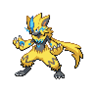

  

  

    

      
Types

      

        
        
      

    

    

      
Abilities

      

        <a href='' title="Whenever an electric-type move hits this Pokemon, it heals for 1/4 of its maximum HP, negating any other effect on it.  This ability will not take effect if this Pokemon is ground-type and thus immune to Electric moves.  Electric moves will ignore this Pokemon's substitute.  This effect includes non-damaging moves, i.e. thunder wave.">Volt-absorb</a>
        
      

    

  

## Base Stats
<table style="width: 100%">
  <tbody style="width: 100%;">
    <tr style="display: flex; align-items: center;">
      <th style="color: #737373;" >HP</th>
      <td style="border-top: none; width: 70px">88</td>
      <td style="width: 100%; min-width: 450px; border-top: none;">
        

        

      </td>
    </tr>
    <tr style="display: flex; align-items: center;">
      <th style="color: #737373;">Attack</th>
      <td style="border-top: none; width: 70px">112</td>
      <td style="width: 100%; min-width: 450px; border-top: none;">
        

        

      </td>
    </tr>
    <tr style="display: flex; align-items: center;">
      <th style="color: #737373;">Defense</th>
      <td style="border-top: none; width: 70px">75</td>
      <td style="width: 100%; min-width: 450px; border-top: none;">
        

        

      </td>
    </tr>
    <tr style="display: flex; align-items: center;">
      <th style="color: #737373;">SP Attack</th>
      <td style="border-top: none; width: 70px">102</td>
      <td style="width: 100%; min-width: 450px; border-top: none;">
        

        

      </td>
    </tr>
    <tr style="display: flex; align-items: center;">
      <th style="color: #737373;">SP Defense</th>
      <td style="border-top: none; width: 70px">80</td>
      <td style="width: 100%; min-width: 450px; border-top: none;">
        

        

      </td>
    </tr>
    <tr style="display: flex; align-items: center;">
      <th style="color: #737373;">Speed</th>
      <td style="border-top: none; width: 70px">143</td>
      <td style="width: 100%; min-width: 450px; border-top: none;">
        

        

      </td>
    </tr>
  </tbody>
</table>

## Moveset

=== "Level Up Moves"
    | Level | Name | Power | Accuracy | PP | Type | Damage Class |
        | -- | -- | -- | -- | -- | -- | -- |
        	| 1 | Fake-out | 40 | 100 | 10 |  |  |
	| 1 | Scratch | 40 | 100 | 35 |  |  |
	| 1 | Quick-attack | 40 | 100 | 30 |  |  |
	| 1 | Spark | 65 | 100 | 20 |  |  |
	| 1 | Power-up-punch | 40 | 100 | 20 |  |  |
	| 8 | Fury-swipes | 18 | 80 | 15 |  |  |
	| 16 | Quick-guard | - | - | 15 |  |  |
	| 24 | Slash | 70 | 100 | 20 |  |  |
	| 40 | Charge | - | - | 20 |  |  |
	| 56 | Hone-claws | - | - | 15 |  |  |
	| 64 | Discharge | 80 | 100 | 15 |  |  |
	| 72 | Wild-charge | 90 | 100 | 15 |  |  |
	| 80 | Agility | - | - | 30 |  |  |
	| 88 | Plasma-fists | 100 | 100 | 15 |  |  |
	| 96 | Close-combat | 120 | 100 | 5 |  |  |

        

=== "Machine Moves"
    | Machine | Name | Power | Accuracy | PP | Type | Damage Class |
        | -- | -- | -- | -- | -- | -- | -- |
        	| TM47 | Low-sweep | 65 | 100 | 20 |  |  |
	| TM54 | False-swipe | 40 | 100 | 40 |  |  |
	| TM135 | Fire-punch | 75 | 100 | 15 |  |  |
	| TM39 | Swift | 60 | - | 20 |  |  |
	| TM05 | Rest | - | - | 5 |  |  |
	| TM56 | Fling | - | 100 | 10 |  |  |
	| TM13 | Snore | 50 | 100 | 15 |  |  |
	| TM62 | Acrobatics | 55 | 100 | 15 |  |  |
	| TM57 | Pay-day | 40 | 100 | 20 |  |  |
	| TM60 | Drain-punch | 75 | 100 | 10 |  |  |
	| TM13 | Brick-break | 75 | 100 | 15 |  |  |
	| TM58 | Assurance | 60 | 100 | 10 |  |  |
	| TM52 | Bounce | 85 | 85 | 5 |  |  |
	| TM00 | Mega-punch | 80 | 85 | 20 |  |  |
	| TM03 | Helping-hand | - | - | 20 |  |  |
	| TM90 | Electric-terrain | - | - | 10 |  |  |
	| TM26 | Scary-face | - | 100 | 10 |  |  |
	| TM82 | Electroweb | 55 | 95 | 15 |  |  |
	| TM59 | Brutal-swing | 60 | 100 | 20 |  |  |
	| TM95 | Snarl | 55 | 95 | 15 |  |  |
	| TM42 | Revenge | 60 | 100 | 10 |  |  |
	| TM01 | Mega-kick | 120 | 75 | 5 |  |  |
	| TM72 | Volt-switch | 70 | 100 | 20 |  |  |
	| TM136 | Thunder-punch | 75 | 100 | 15 |  |  |
	| TM48 | Hyper-beam | 150 | 90 | 5 |  |  |
	| TM07 | Protect | - | - | 10 |  |  |
	| TM12 | Facade | 70 | 100 | 20 |  |  |
	| TM48 | Round | 60 | 100 | 15 |  |  |
	| TM68 | Giga-impact | 150 | 90 | 5 |  |  |
	| TM16 | Thunder-wave | - | 90 | 20 |  |  |

        
