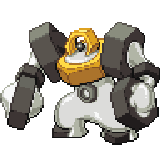

  

  

    

      
Types

      

        
        
      

    

    

      
Abilities

      

        <a href='' title="Moves flagged as being punch-based have 1.2x their base power for this Pokemon.  sucker punch is not flagged as punch-based; its original, Japanese name only means "surprise attack".">Iron-fist</a>
        
      

    

  

## Base Stats
<table style="width: 100%">
  <tbody style="width: 100%;">
    <tr style="display: flex; align-items: center;">
      <th style="color: #737373;" >HP</th>
      <td style="border-top: none; width: 70px">135</td>
      <td style="width: 100%; min-width: 450px; border-top: none;">
        

        

      </td>
    </tr>
    <tr style="display: flex; align-items: center;">
      <th style="color: #737373;">Attack</th>
      <td style="border-top: none; width: 70px">143</td>
      <td style="width: 100%; min-width: 450px; border-top: none;">
        

        

      </td>
    </tr>
    <tr style="display: flex; align-items: center;">
      <th style="color: #737373;">Defense</th>
      <td style="border-top: none; width: 70px">143</td>
      <td style="width: 100%; min-width: 450px; border-top: none;">
        

        

      </td>
    </tr>
    <tr style="display: flex; align-items: center;">
      <th style="color: #737373;">SP Attack</th>
      <td style="border-top: none; width: 70px">80</td>
      <td style="width: 100%; min-width: 450px; border-top: none;">
        

        

      </td>
    </tr>
    <tr style="display: flex; align-items: center;">
      <th style="color: #737373;">SP Defense</th>
      <td style="border-top: none; width: 70px">65</td>
      <td style="width: 100%; min-width: 450px; border-top: none;">
        

        

      </td>
    </tr>
    <tr style="display: flex; align-items: center;">
      <th style="color: #737373;">Speed</th>
      <td style="border-top: none; width: 70px">34</td>
      <td style="width: 100%; min-width: 450px; border-top: none;">
        

        

      </td>
    </tr>
  </tbody>
</table>

## Moveset

=== "Level Up Moves"
    | Level | Name | Power | Accuracy | PP | Type | Damage Class |
        | -- | -- | -- | -- | -- | -- | -- |
        	| 1 | Tail-whip | - | 100 | 30 |  |  |
	| 1 | Harden | - | - | 30 |  |  |
	| 1 | Headbutt | 70 | 100 | 15 |  |  |
	| 1 | Thunder-shock | 40 | 100 | 30 |  |  |
	| 32 | Acid-armor | - | - | 20 |  |  |
	| 40 | Flash-cannon | 80 | 100 | 10 |  |  |
	| 64 | Discharge | 80 | 100 | 15 |  |  |
	| 72 | Dynamic-punch | 100 | 50 | 5 |  |  |
	| 80 | Superpower | 120 | 100 | 5 |  |  |
	| 88 | Double-iron-bash | 60 | 100 | 5 |  |  |

        

=== "Machine Moves"
    | Machine | Name | Power | Accuracy | PP | Type | Damage Class |
        | -- | -- | -- | -- | -- | -- | -- |
        	| TM22 | Rock-slide | 75 | 90 | 10 |  |  |
	| TM05 | Rest | - | - | 5 |  |  |
	| TM13 | Snore | 50 | 100 | 15 |  |  |
	| TM39 | Rock-tomb | 60 | 95 | 15 |  |  |
	| TM13 | Brick-break | 75 | 100 | 15 |  |  |
	| TM35 | Ice-punch | 75 | 100 | 15 |  |  |
	| TM00 | Mega-punch | 80 | 85 | 20 |  |  |
	| TM90 | Electric-terrain | - | - | 10 |  |  |
	| TM45 | Solar-beam | 120 | 100 | 10 |  |  |
	| TM59 | Brutal-swing | 60 | 100 | 20 |  |  |
	| TM01 | Mega-kick | 120 | 75 | 5 |  |  |
	| TM23 | Thunder-punch | 75 | 100 | 15 |  |  |
	| TM48 | Hyper-beam | 150 | 90 | 5 |  |  |
	| TM07 | Protect | - | - | 10 |  |  |
	| TM12 | Facade | 70 | 100 | 20 |  |  |
	| TM48 | Round | 60 | 100 | 15 |  |  |
	| TM68 | Giga-impact | 150 | 90 | 5 |  |  |
	| TM42 | Self-destruct | 200 | 100 | 5 |  |  |
	| TM16 | Thunder-wave | - | 90 | 20 |  |  |

        
