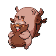

  

  

    

      
Types

      

        
        
      

    

    

      
Abilities

      

        <a href='' title="Restores HP upon eating a Berry, in addition to the Berry's effect.">Cheek-pouch</a>
        /<a href='' title="This Pokemon eats any held Berry triggered by low HP when it falls below 50% of its HP, regardless of the Berry's usual threshold.">Gluttony</a>
      

    

  

## Base Stats
<table style="width: 100%">
  <tbody style="width: 100%;">
    <tr style="display: flex; align-items: center;">
      <th style="color: #737373;" >HP</th>
      <td style="border-top: none; width: 70px">120</td>
      <td style="width: 100%; min-width: 450px; border-top: none;">
        

        

      </td>
    </tr>
    <tr style="display: flex; align-items: center;">
      <th style="color: #737373;">Attack</th>
      <td style="border-top: none; width: 70px">95</td>
      <td style="width: 100%; min-width: 450px; border-top: none;">
        

        

      </td>
    </tr>
    <tr style="display: flex; align-items: center;">
      <th style="color: #737373;">Defense</th>
      <td style="border-top: none; width: 70px">95</td>
      <td style="width: 100%; min-width: 450px; border-top: none;">
        

        

      </td>
    </tr>
    <tr style="display: flex; align-items: center;">
      <th style="color: #737373;">SP Attack</th>
      <td style="border-top: none; width: 70px">55</td>
      <td style="width: 100%; min-width: 450px; border-top: none;">
        

        

      </td>
    </tr>
    <tr style="display: flex; align-items: center;">
      <th style="color: #737373;">SP Defense</th>
      <td style="border-top: none; width: 70px">75</td>
      <td style="width: 100%; min-width: 450px; border-top: none;">
        

        

      </td>
    </tr>
    <tr style="display: flex; align-items: center;">
      <th style="color: #737373;">Speed</th>
      <td style="border-top: none; width: 70px">20</td>
      <td style="width: 100%; min-width: 450px; border-top: none;">
        

        

      </td>
    </tr>
  </tbody>
</table>

## Moveset

=== "Level Up Moves"
    | Level | Name | Power | Accuracy | PP | Type | Damage Class |
        | -- | -- | -- | -- | -- | -- | -- |
        	| 1 | Tail-whip | - | 100 | 30 |  |  |
	| 1 | Tackle | 40 | 100 | 35 |  |  |
	| 1 | Covet | 60 | 100 | 25 |  |  |
	| 1 | Stuff-cheeks | - | - | 10 |  |  |
	| 1 | Bite | 60 | 100 | 25 |  |  |
	| 15 | Spit-up | - | 100 | 10 |  |  |
	| 15 | Swallow | - | - | 10 |  |  |
	| 15 | Stockpile | - | - | 20 |  |  |
	| 20 | Body-slam | 85 | 100 | 15 |  |  |
	| 34 | Counter | - | 100 | 20 |  |  |
	| 48 | Super-fang | - | 90 | 10 |  |  |
	| 55 | Belch | 120 | 90 | 10 |  |  |

        

=== "Machine Moves"
    | Machine | Name | Power | Accuracy | PP | Type | Damage Class |
        | -- | -- | -- | -- | -- | -- | -- |
        	| TM66 | Payback | 50 | 100 | 10 |  |  |
	| TM05 | Rest | - | - | 5 |  |  |
	| TM56 | Fling | - | 100 | 10 |  |  |
	| TM13 | Snore | 50 | 100 | 15 |  |  |
	| TM46 | Thief | 60 | 100 | 25 |  |  |
	| TM130 | Thunder-fang | 65 | 95 | 15 |  |  |
	| TM10 | Dig | 80 | 100 | 10 |  |  |
	| TM09 | Bullet-seed | 25 | 100 | 30 |  |  |
	| TM58 | Assurance | 60 | 100 | 10 |  |  |
	| TM53 | Mud-shot | 55 | 95 | 15 |  |  |
	| TM126 | Fire-fang | 65 | 95 | 15 |  |  |
	| TM45 | Attract | - | 100 | 15 |  |  |
	| TM128 | Ice-fang | 65 | 95 | 15 |  |  |
	| TM59 | Brutal-swing | 60 | 100 | 20 |  |  |
	| TM84 | Tail-slap | 25 | 85 | 10 |  |  |
	| TM98 | Stomping-tantrum | 75 | 100 | 10 |  |  |
	| TM48 | Hyper-beam | 150 | 90 | 5 |  |  |
	| TM07 | Protect | - | - | 10 |  |  |
	| TM12 | Facade | 70 | 100 | 20 |  |  |
	| TM48 | Round | 60 | 100 | 15 |  |  |
	| TM68 | Giga-impact | 150 | 90 | 5 |  |  |

        
