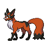

  

  

    

      
Types

      

        
        
      

    

    

      
Abilities

      

        <a href='' title="This Pokemon is always successful fleeing from wild battles, even if trapped by a move or ability.">Run-away</a>
        /<a href='' title="When this Pokemon uses or loses its held item, its Speed is doubled.  If it gains another item or leaves battle, this bonus is lost.  This includes when the Pokemon drops its item because of knock off.  This bonus does not count as a stat modifier.  There is no notification when this ability takes effect.">Unburden</a>
      

    

  

## Base Stats
<table style="width: 100%">
  <tbody style="width: 100%;">
    <tr style="display: flex; align-items: center;">
      <th style="color: #737373;" >HP</th>
      <td style="border-top: none; width: 70px">70</td>
      <td style="width: 100%; min-width: 450px; border-top: none;">
        

        

      </td>
    </tr>
    <tr style="display: flex; align-items: center;">
      <th style="color: #737373;">Attack</th>
      <td style="border-top: none; width: 70px">58</td>
      <td style="width: 100%; min-width: 450px; border-top: none;">
        

        

      </td>
    </tr>
    <tr style="display: flex; align-items: center;">
      <th style="color: #737373;">Defense</th>
      <td style="border-top: none; width: 70px">58</td>
      <td style="width: 100%; min-width: 450px; border-top: none;">
        

        

      </td>
    </tr>
    <tr style="display: flex; align-items: center;">
      <th style="color: #737373;">SP Attack</th>
      <td style="border-top: none; width: 70px">87</td>
      <td style="width: 100%; min-width: 450px; border-top: none;">
        

        

      </td>
    </tr>
    <tr style="display: flex; align-items: center;">
      <th style="color: #737373;">SP Defense</th>
      <td style="border-top: none; width: 70px">92</td>
      <td style="width: 100%; min-width: 450px; border-top: none;">
        

        

      </td>
    </tr>
    <tr style="display: flex; align-items: center;">
      <th style="color: #737373;">Speed</th>
      <td style="border-top: none; width: 70px">90</td>
      <td style="width: 100%; min-width: 450px; border-top: none;">
        

        

      </td>
    </tr>
  </tbody>
</table>

## Moveset

=== "Level Up Moves"
    | Level | Name | Power | Accuracy | PP | Type | Damage Class |
        | -- | -- | -- | -- | -- | -- | -- |
        	| 1 | Tail-whip | - | 100 | 30 |  |  |
	| 1 | Hone-claws | - | - | 15 |  |  |
	| 1 | Quick-attack | 40 | 100 | 30 |  |  |
	| 22 | Nasty-plot | - | - | 20 |  |  |
	| 28 | Sucker-punch | 70 | 100 | 5 |  |  |
	| 34 | Night-slash | 70 | 100 | 15 |  |  |
	| 46 | Foul-play | 95 | 100 | 15 |  |  |
	| 52 | Parting-shot | - | 100 | 20 |  |  |

        

=== "Machine Moves"
    | Machine | Name | Power | Accuracy | PP | Type | Damage Class |
        | -- | -- | -- | -- | -- | -- | -- |
        	| TM37 | Beat-up | - | 100 | 10 |  |  |
	| TM16 | Screech | - | 85 | 40 |  |  |
	| TM39 | Swift | 60 | - | 20 |  |  |
	| TM05 | Rest | - | - | 5 |  |  |
	| TM13 | Snore | 50 | 100 | 15 |  |  |
	| TM62 | Acrobatics | 55 | 100 | 15 |  |  |
	| TM65 | Shadow-claw | 70 | 100 | 15 |  |  |
	| TM47 | Fake-tears | - | 100 | 20 |  |  |
	| TM46 | Thief | 60 | 100 | 25 |  |  |
	| TM89 | U-turn | 70 | 100 | 20 |  |  |
	| TM130 | Thunder-fang | 65 | 95 | 15 |  |  |
	| TM10 | Dig | 80 | 100 | 10 |  |  |
	| TM58 | Assurance | 60 | 100 | 10 |  |  |
	| TM53 | Mud-shot | 55 | 95 | 15 |  |  |
	| TM126 | Fire-fang | 65 | 95 | 15 |  |  |
	| TM45 | Attract | - | 100 | 15 |  |  |
	| TM128 | Ice-fang | 65 | 95 | 15 |  |  |
	| TM84 | Tail-slap | 25 | 85 | 10 |  |  |
	| TM95 | Snarl | 55 | 95 | 15 |  |  |
	| TM48 | Hyper-beam | 150 | 90 | 5 |  |  |
	| TM07 | Protect | - | - | 10 |  |  |
	| TM12 | Facade | 70 | 100 | 20 |  |  |
	| TM48 | Round | 60 | 100 | 15 |  |  |
	| TM68 | Giga-impact | 150 | 90 | 5 |  |  |

        
