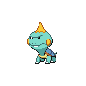

  

  

    

      
Types

      

        
        
      

    

    

      
Abilities

      

        <a href='' title="Strengthens biting moves to 1.5x their power.">Strong-jaw</a>
        /<a href='' title="Moves cannot score critical hits against this Pokemon.  This ability functions identically to battle armor.">Shell-armor</a>
      

    

  

## Base Stats
<table style="width: 100%">
  <tbody style="width: 100%;">
    <tr style="display: flex; align-items: center;">
      <th style="color: #737373;" >HP</th>
      <td style="border-top: none; width: 70px">50</td>
      <td style="width: 100%; min-width: 450px; border-top: none;">
        

        

      </td>
    </tr>
    <tr style="display: flex; align-items: center;">
      <th style="color: #737373;">Attack</th>
      <td style="border-top: none; width: 70px">64</td>
      <td style="width: 100%; min-width: 450px; border-top: none;">
        

        

      </td>
    </tr>
    <tr style="display: flex; align-items: center;">
      <th style="color: #737373;">Defense</th>
      <td style="border-top: none; width: 70px">50</td>
      <td style="width: 100%; min-width: 450px; border-top: none;">
        

        

      </td>
    </tr>
    <tr style="display: flex; align-items: center;">
      <th style="color: #737373;">SP Attack</th>
      <td style="border-top: none; width: 70px">38</td>
      <td style="width: 100%; min-width: 450px; border-top: none;">
        

        

      </td>
    </tr>
    <tr style="display: flex; align-items: center;">
      <th style="color: #737373;">SP Defense</th>
      <td style="border-top: none; width: 70px">38</td>
      <td style="width: 100%; min-width: 450px; border-top: none;">
        

        

      </td>
    </tr>
    <tr style="display: flex; align-items: center;">
      <th style="color: #737373;">Speed</th>
      <td style="border-top: none; width: 70px">44</td>
      <td style="width: 100%; min-width: 450px; border-top: none;">
        

        

      </td>
    </tr>
  </tbody>
</table>

## Moveset

=== "Level Up Moves"
    | Level | Name | Power | Accuracy | PP | Type | Damage Class |
        | -- | -- | -- | -- | -- | -- | -- |
        	| 1 | Tackle | 40 | 100 | 35 |  |  |
	| 1 | Water-gun | 40 | 100 | 25 |  |  |
	| 7 | Bite | 60 | 100 | 25 |  |  |
	| 21 | Headbutt | 70 | 100 | 15 |  |  |
	| 28 | Counter | - | 100 | 20 |  |  |
	| 35 | Jaw-lock | 80 | 100 | 10 |  |  |
	| 42 | Liquidation | 85 | 100 | 10 |  |  |
	| 49 | Body-slam | 85 | 100 | 15 |  |  |

        

=== "Machine Moves"
    | Machine | Name | Power | Accuracy | PP | Type | Damage Class |
        | -- | -- | -- | -- | -- | -- | -- |
        	| TM66 | Payback | 50 | 100 | 10 |  |  |
	| TM45 | Dive | 80 | 100 | 10 |  |  |
	| TM36 | Whirlpool | 35 | 85 | 15 |  |  |
	| TM05 | Rest | - | - | 5 |  |  |
	| TM13 | Snore | 50 | 100 | 15 |  |  |
	| TM58 | Assurance | 60 | 100 | 10 |  |  |
	| TM53 | Mud-shot | 55 | 95 | 15 |  |  |
	| TM45 | Attract | - | 100 | 15 |  |  |
	| TM128 | Ice-fang | 65 | 95 | 15 |  |  |
	| TM42 | Revenge | 60 | 100 | 10 |  |  |
	| TM07 | Protect | - | - | 10 |  |  |
	| TM12 | Facade | 70 | 100 | 20 |  |  |
	| TM48 | Round | 60 | 100 | 15 |  |  |
	| TM18 | Rain-dance | - | - | 5 |  |  |

        
