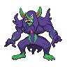

  

  

    

      
Types

      

        
        
      

    

    

      
Abilities

      

        <a href='' title="This Pokemon's non-damaging moves have their priority increased by one stage.">Prankster</a>
        /<a href='' title="When this Pokemon enters battle, it reveals an opposing Pokemon's held item to all participating trainers.  In a double battle, if one opponent has an item, this Pokemon will Frisk that Pokemon; if both have an item, it will Frisk one at random.">Frisk</a>
      

    

  

## Base Stats
<table style="width: 100%">
  <tbody style="width: 100%;">
    <tr style="display: flex; align-items: center;">
      <th style="color: #737373;" >HP</th>
      <td style="border-top: none; width: 70px">95</td>
      <td style="width: 100%; min-width: 450px; border-top: none;">
        

        

      </td>
    </tr>
    <tr style="display: flex; align-items: center;">
      <th style="color: #737373;">Attack</th>
      <td style="border-top: none; width: 70px">120</td>
      <td style="width: 100%; min-width: 450px; border-top: none;">
        

        

      </td>
    </tr>
    <tr style="display: flex; align-items: center;">
      <th style="color: #737373;">Defense</th>
      <td style="border-top: none; width: 70px">65</td>
      <td style="width: 100%; min-width: 450px; border-top: none;">
        

        

      </td>
    </tr>
    <tr style="display: flex; align-items: center;">
      <th style="color: #737373;">SP Attack</th>
      <td style="border-top: none; width: 70px">95</td>
      <td style="width: 100%; min-width: 450px; border-top: none;">
        

        

      </td>
    </tr>
    <tr style="display: flex; align-items: center;">
      <th style="color: #737373;">SP Defense</th>
      <td style="border-top: none; width: 70px">75</td>
      <td style="width: 100%; min-width: 450px; border-top: none;">
        

        

      </td>
    </tr>
    <tr style="display: flex; align-items: center;">
      <th style="color: #737373;">Speed</th>
      <td style="border-top: none; width: 70px">60</td>
      <td style="width: 100%; min-width: 450px; border-top: none;">
        

        

      </td>
    </tr>
  </tbody>
</table>

## Moveset

=== "Level Up Moves"
    | Level | Name | Power | Accuracy | PP | Type | Damage Class |
        | -- | -- | -- | -- | -- | -- | -- |
        	| 1 | Bulk-up | - | - | 20 |  |  |
	| 1 | Confide | - | - | 20 |  |  |
	| 1 | Spirit-break | 75 | 100 | 15 |  |  |
	| 1 | Fake-out | 40 | 100 | 10 |  |  |
	| 1 | False-surrender | 80 | - | 10 |  |  |
	| 1 | Flatter | - | 100 | 15 |  |  |
	| 1 | Bite | 60 | 100 | 25 |  |  |
	| 1 | Power-up-punch | 40 | 100 | 20 |  |  |
	| 20 | Swagger | - | 85 | 15 |  |  |
	| 24 | Sucker-punch | 70 | 100 | 5 |  |  |
	| 28 | Torment | - | 100 | 15 |  |  |
	| 35 | Dark-pulse | 80 | 100 | 15 |  |  |
	| 40 | Nasty-plot | - | - | 20 |  |  |
	| 48 | Play-rough | 90 | 90 | 10 |  |  |
	| 56 | Foul-play | 95 | 100 | 15 |  |  |
	| 64 | Hammer-arm | 100 | 90 | 10 |  |  |

        

=== "Machine Moves"
    | Machine | Name | Power | Accuracy | PP | Type | Damage Class |
        | -- | -- | -- | -- | -- | -- | -- |
        	| TM47 | Low-sweep | 65 | 100 | 20 |  |  |
	| TM135 | Fire-punch | 75 | 100 | 15 |  |  |
	| TM05 | Rest | - | - | 5 |  |  |
	| TM13 | Snore | 50 | 100 | 15 |  |  |
	| TM65 | Shadow-claw | 70 | 100 | 15 |  |  |
	| TM60 | Drain-punch | 75 | 100 | 10 |  |  |
	| TM47 | Fake-tears | - | 100 | 20 |  |  |
	| TM46 | Thief | 60 | 100 | 25 |  |  |
	| TM13 | Brick-break | 75 | 100 | 15 |  |  |
	| TM134 | Ice-punch | 75 | 100 | 15 |  |  |
	| TM71 | Wonder-room | - | - | 10 |  |  |
	| TM58 | Assurance | 60 | 100 | 10 |  |  |
	| TM00 | Mega-punch | 80 | 85 | 20 |  |  |
	| TM60 | Power-swap | - | - | 10 |  |  |
	| TM26 | Scary-face | - | 100 | 10 |  |  |
	| TM45 | Attract | - | 100 | 15 |  |  |
	| TM42 | Revenge | 60 | 100 | 10 |  |  |
	| TM01 | Mega-kick | 120 | 75 | 5 |  |  |
	| TM16 | Light-screen | - | - | 30 |  |  |
	| TM136 | Thunder-punch | 75 | 100 | 15 |  |  |
	| TM98 | Stomping-tantrum | 75 | 100 | 10 |  |  |
	| TM48 | Hyper-beam | 150 | 90 | 5 |  |  |
	| TM07 | Protect | - | - | 10 |  |  |
	| TM12 | Facade | 70 | 100 | 20 |  |  |
	| TM67 | Retaliate | 70 | 100 | 5 |  |  |
	| TM48 | Round | 60 | 100 | 15 |  |  |
	| TM68 | Giga-impact | 150 | 90 | 5 |  |  |
	| TM33 | Reflect | - | - | 20 |  |  |
	| TM87 | Draining-kiss | 50 | 100 | 10 |  |  |
	| TM16 | Thunder-wave | - | 90 | 20 |  |  |

        
