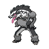

  

  

    

      
Types

      

        
        
      

    

    

      
Abilities

      

        <a href='' title="This Pokemon's recoil moves and crash moves have 1.2x their base power.  struggle is unaffected.  The "crash moves" are the moves that damage the user upon missing: jump kick and high jump kick.">Reckless</a>
        /<a href='' title="Whenever this Pokemon is asleep, burned, paralyzed, or poisoned, it has 1.5x its Attack.  This Pokemon is not affected by the usual Attack cut from a burn.  This bonus does not count as a stat modifier.">Guts</a>
      

    

  

## Base Stats
<table style="width: 100%">
  <tbody style="width: 100%;">
    <tr style="display: flex; align-items: center;">
      <th style="color: #737373;" >HP</th>
      <td style="border-top: none; width: 70px">93</td>
      <td style="width: 100%; min-width: 450px; border-top: none;">
        

        

      </td>
    </tr>
    <tr style="display: flex; align-items: center;">
      <th style="color: #737373;">Attack</th>
      <td style="border-top: none; width: 70px">90</td>
      <td style="width: 100%; min-width: 450px; border-top: none;">
        

        

      </td>
    </tr>
    <tr style="display: flex; align-items: center;">
      <th style="color: #737373;">Defense</th>
      <td style="border-top: none; width: 70px">101</td>
      <td style="width: 100%; min-width: 450px; border-top: none;">
        

        

      </td>
    </tr>
    <tr style="display: flex; align-items: center;">
      <th style="color: #737373;">SP Attack</th>
      <td style="border-top: none; width: 70px">60</td>
      <td style="width: 100%; min-width: 450px; border-top: none;">
        

        

      </td>
    </tr>
    <tr style="display: flex; align-items: center;">
      <th style="color: #737373;">SP Defense</th>
      <td style="border-top: none; width: 70px">81</td>
      <td style="width: 100%; min-width: 450px; border-top: none;">
        

        

      </td>
    </tr>
    <tr style="display: flex; align-items: center;">
      <th style="color: #737373;">Speed</th>
      <td style="border-top: none; width: 70px">95</td>
      <td style="width: 100%; min-width: 450px; border-top: none;">
        

        

      </td>
    </tr>
  </tbody>
</table>

## Moveset

=== "Level Up Moves"
    | Level | Name | Power | Accuracy | PP | Type | Damage Class |
        | -- | -- | -- | -- | -- | -- | -- |
        	| 1 | Tackle | 40 | 100 | 35 |  |  |
	| 1 | Cross-chop | 100 | 80 | 5 |  |  |
	| 1 | Leer | - | 100 | 30 |  |  |
	| 1 | Switcheroo | - | 100 | 10 |  |  |
	| 1 | Submission | 80 | 80 | 20 |  |  |
	| 1 | Night-slash | 70 | 100 | 15 |  |  |
	| 1 | Obstruct | - | 100 | 10 |  |  |
	| 1 | Sand-attack | - | 100 | 15 |  |  |
	| 1 | Lick | 30 | 100 | 30 |  |  |
	| 1 | Baby-doll-eyes | - | 100 | 30 |  |  |
	| 12 | Headbutt | 70 | 100 | 15 |  |  |
	| 15 | Hone-claws | - | - | 15 |  |  |
	| 18 | Fury-swipes | 18 | 80 | 15 |  |  |
	| 28 | Take-down | 90 | 85 | 20 |  |  |
	| 42 | Counter | - | 100 | 20 |  |  |
	| 49 | Taunt | - | 100 | 20 |  |  |
	| 56 | Double-edge | 120 | 100 | 15 |  |  |

        

=== "Machine Moves"
    | Machine | Name | Power | Accuracy | PP | Type | Damage Class |
        | -- | -- | -- | -- | -- | -- | -- |
        	| TM16 | Screech | - | 85 | 40 |  |  |
	| TM66 | Payback | 50 | 100 | 10 |  |  |
	| TM73 | Cross-poison | 70 | 100 | 20 |  |  |
	| TM36 | Whirlpool | 35 | 85 | 15 |  |  |
	| TM135 | Fire-punch | 75 | 100 | 15 |  |  |
	| TM39 | Swift | 60 | - | 20 |  |  |
	| TM05 | Rest | - | - | 5 |  |  |
	| TM56 | Fling | - | 100 | 10 |  |  |
	| TM13 | Snore | 50 | 100 | 15 |  |  |
	| TM65 | Shadow-claw | 70 | 100 | 15 |  |  |
	| TM47 | Fake-tears | - | 100 | 20 |  |  |
	| TM46 | Thief | 60 | 100 | 25 |  |  |
	| TM13 | Brick-break | 75 | 100 | 15 |  |  |
	| TM10 | Dig | 80 | 100 | 10 |  |  |
	| TM16 | Icy-wind | 55 | 95 | 15 |  |  |
	| TM134 | Ice-punch | 75 | 100 | 15 |  |  |
	| TM58 | Assurance | 60 | 100 | 10 |  |  |
	| TM07 | Pin-missile | 25 | 95 | 20 |  |  |
	| TM00 | Mega-punch | 80 | 85 | 20 |  |  |
	| TM03 | Helping-hand | - | - | 20 |  |  |
	| TM53 | Mud-shot | 55 | 95 | 15 |  |  |
	| TM26 | Scary-face | - | 100 | 10 |  |  |
	| TM45 | Attract | - | 100 | 15 |  |  |
	| TM95 | Snarl | 55 | 95 | 15 |  |  |
	| TM42 | Revenge | 60 | 100 | 10 |  |  |
	| TM11 | Sunny-day | - | - | 5 |  |  |
	| TM01 | Mega-kick | 120 | 75 | 5 |  |  |
	| TM136 | Thunder-punch | 75 | 100 | 15 |  |  |
	| TM98 | Stomping-tantrum | 75 | 100 | 10 |  |  |
	| TM48 | Hyper-beam | 150 | 90 | 5 |  |  |
	| TM07 | Protect | - | - | 10 |  |  |
	| TM12 | Facade | 70 | 100 | 20 |  |  |
	| TM67 | Retaliate | 70 | 100 | 5 |  |  |
	| TM48 | Round | 60 | 100 | 15 |  |  |
	| TM18 | Rain-dance | - | - | 5 |  |  |
	| TM68 | Giga-impact | 150 | 90 | 5 |  |  |
	| TM16 | Thunder-wave | - | 90 | 20 |  |  |

        
