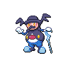

  

  

    

      
Types

      

        
        
      

    

    

      
Abilities

      

        <a href='' title="When this Pokemon is confused, it has twice its evasion.">Tangled-feet</a>
        /<a href='' title="Increases super-effective damage dealt to 1.25x.">Screen-cleaner</a>
      

    

  

## Base Stats
<table style="width: 100%">
  <tbody style="width: 100%;">
    <tr style="display: flex; align-items: center;">
      <th style="color: #737373;" >HP</th>
      <td style="border-top: none; width: 70px">80</td>
      <td style="width: 100%; min-width: 450px; border-top: none;">
        

        

      </td>
    </tr>
    <tr style="display: flex; align-items: center;">
      <th style="color: #737373;">Attack</th>
      <td style="border-top: none; width: 70px">85</td>
      <td style="width: 100%; min-width: 450px; border-top: none;">
        

        

      </td>
    </tr>
    <tr style="display: flex; align-items: center;">
      <th style="color: #737373;">Defense</th>
      <td style="border-top: none; width: 70px">75</td>
      <td style="width: 100%; min-width: 450px; border-top: none;">
        

        

      </td>
    </tr>
    <tr style="display: flex; align-items: center;">
      <th style="color: #737373;">SP Attack</th>
      <td style="border-top: none; width: 70px">110</td>
      <td style="width: 100%; min-width: 450px; border-top: none;">
        

        

      </td>
    </tr>
    <tr style="display: flex; align-items: center;">
      <th style="color: #737373;">SP Defense</th>
      <td style="border-top: none; width: 70px">100</td>
      <td style="width: 100%; min-width: 450px; border-top: none;">
        

        

      </td>
    </tr>
    <tr style="display: flex; align-items: center;">
      <th style="color: #737373;">Speed</th>
      <td style="border-top: none; width: 70px">70</td>
      <td style="width: 100%; min-width: 450px; border-top: none;">
        

        

      </td>
    </tr>
  </tbody>
</table>

## Moveset

=== "Level Up Moves"
    | Level | Name | Power | Accuracy | PP | Type | Damage Class |
        | -- | -- | -- | -- | -- | -- | -- |
        	| 1 | Encore | - | 100 | 5 |  |  |
	| 1 | Mimic | - | - | 10 |  |  |
	| 1 | Recycle | - | - | 10 |  |  |
	| 1 | Pound | 40 | 100 | 35 |  |  |
	| 1 | Rapid-spin | 50 | 100 | 40 |  |  |
	| 1 | After-you | - | - | 15 |  |  |
	| 1 | Dazzling-gleam | 80 | 100 | 10 |  |  |
	| 1 | Copycat | - | - | 20 |  |  |
	| 1 | Block | - | - | 5 |  |  |
	| 1 | Ice-shard | 40 | 100 | 30 |  |  |
	| 1 | Slack-off | - | - | 5 |  |  |
	| 1 | Role-play | - | - | 10 |  |  |
	| 1 | Baton-pass | - | - | 40 |  |  |
	| 12 | Confusion | 50 | 100 | 25 |  |  |
	| 16 | Ally-switch | - | - | 15 |  |  |
	| 24 | Double-kick | 30 | 100 | 30 |  |  |
	| 28 | Psybeam | 65 | 100 | 20 |  |  |
	| 32 | Hypnosis | - | 60 | 20 |  |  |
	| 36 | Mirror-coat | - | 100 | 20 |  |  |
	| 40 | Sucker-punch | 70 | 100 | 5 |  |  |
	| 44 | Freeze-dry | 70 | 100 | 20 |  |  |
	| 48 | Psychic | 90 | 100 | 10 |  |  |
	| 52 | Teeter-dance | - | 100 | 20 |  |  |

        

=== "Machine Moves"
    | Machine | Name | Power | Accuracy | PP | Type | Damage Class |
        | -- | -- | -- | -- | -- | -- | -- |
        	| TM16 | Screech | - | 85 | 40 |  |  |
	| TM66 | Payback | 50 | 100 | 10 |  |  |
	| TM05 | Rest | - | - | 5 |  |  |
	| TM56 | Fling | - | 100 | 10 |  |  |
	| TM61 | Guard-swap | - | - | 10 |  |  |
	| TM13 | Snore | 50 | 100 | 15 |  |  |
	| TM29 | Charm | - | 100 | 20 |  |  |
	| TM60 | Drain-punch | 75 | 100 | 10 |  |  |
	| TM47 | Fake-tears | - | 100 | 20 |  |  |
	| TM46 | Thief | 60 | 100 | 25 |  |  |
	| TM13 | Brick-break | 75 | 100 | 15 |  |  |
	| TM16 | Icy-wind | 55 | 95 | 15 |  |  |
	| TM134 | Ice-punch | 75 | 100 | 15 |  |  |
	| TM72 | Magic-room | - | - | 10 |  |  |
	| TM71 | Wonder-room | - | - | 10 |  |  |
	| TM07 | Hail | - | - | 10 |  |  |
	| TM92 | Trick-room | - | - | 5 |  |  |
	| TM00 | Mega-punch | 80 | 85 | 20 |  |  |
	| TM03 | Helping-hand | - | - | 20 |  |  |
	| TM91 | Psychic-terrain | - | - | 10 |  |  |
	| TM60 | Power-swap | - | - | 10 |  |  |
	| TM89 | Misty-terrain | - | - | 10 |  |  |
	| TM45 | Attract | - | 100 | 15 |  |  |
	| TM45 | Solar-beam | 120 | 100 | 10 |  |  |
	| TM11 | Sunny-day | - | - | 5 |  |  |
	| TM01 | Mega-kick | 120 | 75 | 5 |  |  |
	| TM51 | Icicle-spear | 25 | 100 | 30 |  |  |
	| TM16 | Light-screen | - | - | 30 |  |  |
	| TM98 | Stomping-tantrum | 75 | 100 | 10 |  |  |
	| TM20 | Safeguard | - | - | 25 |  |  |
	| TM48 | Hyper-beam | 150 | 90 | 5 |  |  |
	| TM07 | Protect | - | - | 10 |  |  |
	| TM12 | Facade | 70 | 100 | 20 |  |  |
	| TM48 | Round | 60 | 100 | 15 |  |  |
	| TM18 | Rain-dance | - | - | 5 |  |  |
	| TM68 | Giga-impact | 150 | 90 | 5 |  |  |
	| TM33 | Reflect | - | - | 20 |  |  |
	| TM64 | Avalanche | 60 | 100 | 10 |  |  |
	| TM16 | Thunder-wave | - | 90 | 20 |  |  |

        
