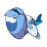

  

  

    

      
Types

      

        
        
      

    

    

      
Abilities

      

        <a href='' title="Whenever a water-type move hits this Pokemon, it heals for 1/4 of its maximum HP, negating any other effect on it.  Water moves will ignore this Pokemon's substitute.">Water-absorb</a>
        /<a href='' title="This Pokemon heals for 1/16 of its maximum HP after each turn during hail, and it does not take hail damage regardless of type.">Ice-body</a>
      

    

  

## Base Stats
<table style="width: 100%">
  <tbody style="width: 100%;">
    <tr style="display: flex; align-items: center;">
      <th style="color: #737373;" >HP</th>
      <td style="border-top: none; width: 70px">90</td>
      <td style="width: 100%; min-width: 450px; border-top: none;">
        

        

      </td>
    </tr>
    <tr style="display: flex; align-items: center;">
      <th style="color: #737373;">Attack</th>
      <td style="border-top: none; width: 70px">90</td>
      <td style="width: 100%; min-width: 450px; border-top: none;">
        

        

      </td>
    </tr>
    <tr style="display: flex; align-items: center;">
      <th style="color: #737373;">Defense</th>
      <td style="border-top: none; width: 70px">100</td>
      <td style="width: 100%; min-width: 450px; border-top: none;">
        

        

      </td>
    </tr>
    <tr style="display: flex; align-items: center;">
      <th style="color: #737373;">SP Attack</th>
      <td style="border-top: none; width: 70px">80</td>
      <td style="width: 100%; min-width: 450px; border-top: none;">
        

        

      </td>
    </tr>
    <tr style="display: flex; align-items: center;">
      <th style="color: #737373;">SP Defense</th>
      <td style="border-top: none; width: 70px">90</td>
      <td style="width: 100%; min-width: 450px; border-top: none;">
        

        

      </td>
    </tr>
    <tr style="display: flex; align-items: center;">
      <th style="color: #737373;">Speed</th>
      <td style="border-top: none; width: 70px">55</td>
      <td style="width: 100%; min-width: 450px; border-top: none;">
        

        

      </td>
    </tr>
  </tbody>
</table>

## Moveset

=== "Level Up Moves"
    | Level | Name | Power | Accuracy | PP | Type | Damage Class |
        | -- | -- | -- | -- | -- | -- | -- |
        	| 1 | Water-gun | 40 | 100 | 25 |  |  |
	| 1 | Powder-snow | 40 | 100 | 25 |  |  |
	| 21 | Ancient-power | 60 | 100 | 5 |  |  |
	| 28 | Bite | 60 | 100 | 25 |  |  |
	| 35 | Aurora-veil | - | - | 20 |  |  |
	| 42 | Freeze-dry | 70 | 100 | 20 |  |  |
	| 49 | Super-fang | - | 90 | 10 |  |  |
	| 56 | Crunch | 80 | 100 | 15 |  |  |
	| 63 | Fishious-rend | 85 | 100 | 10 |  |  |
	| 70 | Icicle-crash | 85 | 90 | 10 |  |  |
	| 77 | Blizzard | 110 | 70 | 5 |  |  |

        

=== "Machine Moves"
    | Machine | Name | Power | Accuracy | PP | Type | Damage Class |
        | -- | -- | -- | -- | -- | -- | -- |
        	| TM22 | Rock-slide | 75 | 90 | 10 |  |  |
	| TM54 | Rock-blast | 25 | 90 | 10 |  |  |
	| TM45 | Dive | 80 | 100 | 10 |  |  |
	| TM36 | Whirlpool | 35 | 85 | 15 |  |  |
	| TM05 | Rest | - | - | 5 |  |  |
	| TM13 | Snore | 50 | 100 | 15 |  |  |
	| TM39 | Rock-tomb | 60 | 95 | 15 |  |  |
	| TM16 | Icy-wind | 55 | 95 | 15 |  |  |
	| TM07 | Hail | - | - | 10 |  |  |
	| TM128 | Ice-fang | 65 | 95 | 15 |  |  |
	| TM51 | Icicle-spear | 25 | 100 | 30 |  |  |
	| TM48 | Hyper-beam | 150 | 90 | 5 |  |  |
	| TM07 | Protect | - | - | 10 |  |  |
	| TM55 | Brine | 65 | 100 | 10 |  |  |
	| TM12 | Facade | 70 | 100 | 20 |  |  |
	| TM48 | Round | 60 | 100 | 15 |  |  |
	| TM18 | Rain-dance | - | - | 5 |  |  |
	| TM68 | Giga-impact | 150 | 90 | 5 |  |  |
	| TM64 | Avalanche | 60 | 100 | 10 |  |  |

        
