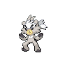

  

  

    

      
Types

      

        
        
      

    

    

      
Abilities

      

        <a href='' title="This Pokemon cannot flinch.">Inner-focus</a>
        
      

    

  

## Base Stats
<table style="width: 100%">
  <tbody style="width: 100%;">
    <tr style="display: flex; align-items: center;">
      <th style="color: #737373;" >HP</th>
      <td style="border-top: none; width: 70px">60</td>
      <td style="width: 100%; min-width: 450px; border-top: none;">
        

        

      </td>
    </tr>
    <tr style="display: flex; align-items: center;">
      <th style="color: #737373;">Attack</th>
      <td style="border-top: none; width: 70px">90</td>
      <td style="width: 100%; min-width: 450px; border-top: none;">
        

        

      </td>
    </tr>
    <tr style="display: flex; align-items: center;">
      <th style="color: #737373;">Defense</th>
      <td style="border-top: none; width: 70px">60</td>
      <td style="width: 100%; min-width: 450px; border-top: none;">
        

        

      </td>
    </tr>
    <tr style="display: flex; align-items: center;">
      <th style="color: #737373;">SP Attack</th>
      <td style="border-top: none; width: 70px">53</td>
      <td style="width: 100%; min-width: 450px; border-top: none;">
        

        

      </td>
    </tr>
    <tr style="display: flex; align-items: center;">
      <th style="color: #737373;">SP Defense</th>
      <td style="border-top: none; width: 70px">50</td>
      <td style="width: 100%; min-width: 450px; border-top: none;">
        

        

      </td>
    </tr>
    <tr style="display: flex; align-items: center;">
      <th style="color: #737373;">Speed</th>
      <td style="border-top: none; width: 70px">72</td>
      <td style="width: 100%; min-width: 450px; border-top: none;">
        

        

      </td>
    </tr>
  </tbody>
</table>

## Moveset

=== "Level Up Moves"
    | Level | Name | Power | Accuracy | PP | Type | Damage Class |
        | -- | -- | -- | -- | -- | -- | -- |
        	| 1 | Leer | - | 100 | 30 |  |  |
	| 1 | Rock-smash | 40 | 100 | 15 |  |  |
	| 4 | Endure | - | - | 10 |  |  |
	| 8 | Focus-energy | - | - | 30 |  |  |
	| 12 | Aerial-ace | 60 | - | 20 |  |  |
	| 20 | Headbutt | 70 | 100 | 15 |  |  |
	| 28 | Detect | - | - | 5 |  |  |
	| 32 | Bulk-up | - | - | 20 |  |  |
	| 36 | Iron-head | 80 | 100 | 15 |  |  |
	| 40 | Dynamic-punch | 100 | 50 | 5 |  |  |
	| 44 | Counter | - | 100 | 20 |  |  |
	| 48 | Close-combat | 120 | 100 | 5 |  |  |
	| 52 | Focus-punch | 150 | 100 | 20 |  |  |

        

=== "Machine Moves"
    | Machine | Name | Power | Accuracy | PP | Type | Damage Class |
        | -- | -- | -- | -- | -- | -- | -- |
        	| TM47 | Low-sweep | 65 | 100 | 20 |  |  |
	| TM135 | Fire-punch | 75 | 100 | 15 |  |  |
	| TM05 | Rest | - | - | 5 |  |  |
	| TM13 | Snore | 50 | 100 | 15 |  |  |
	| TM62 | Acrobatics | 55 | 100 | 15 |  |  |
	| TM89 | U-turn | 70 | 100 | 20 |  |  |
	| TM13 | Brick-break | 75 | 100 | 15 |  |  |
	| TM10 | Dig | 80 | 100 | 10 |  |  |
	| TM134 | Ice-punch | 75 | 100 | 15 |  |  |
	| TM00 | Mega-punch | 80 | 85 | 20 |  |  |
	| TM03 | Helping-hand | - | - | 20 |  |  |
	| TM26 | Scary-face | - | 100 | 10 |  |  |
	| TM45 | Attract | - | 100 | 15 |  |  |
	| TM42 | Revenge | 60 | 100 | 10 |  |  |
	| TM01 | Mega-kick | 120 | 75 | 5 |  |  |
	| TM136 | Thunder-punch | 75 | 100 | 15 |  |  |
	| TM07 | Protect | - | - | 10 |  |  |
	| TM12 | Facade | 70 | 100 | 20 |  |  |
	| TM67 | Retaliate | 70 | 100 | 5 |  |  |
	| TM48 | Round | 60 | 100 | 15 |  |  |

        
