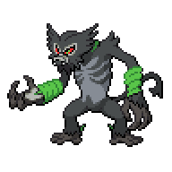

  

  

    

      
Types

      

        
        
      

    

    

      
Abilities

      

        <a href='' title='This Pokemon's non-damaging moves have their priority increased by one stage.'>Prankster</a>
        /<a href='' title="Increases super-effective damage dealt to 1.25x.">Gorilla-tactics</a>
      

    

  

## Base Stats
<table style="width: 100%">
  <tbody style="width: 100%;">
    <tr style="display: flex; align-items: center;">
      <th style="color: #737373;" >HP</th>
      <td style="border-top: none; width: 70px">105</td>
      <td style="width: 100%; min-width: 450px; border-top: none;">
        

        

      </td>
    </tr>
    <tr style="display: flex; align-items: center;">
      <th style="color: #737373;">Attack</th>
      <td style="border-top: none; width: 70px">120</td>
      <td style="width: 100%; min-width: 450px; border-top: none;">
        

        

      </td>
    </tr>
    <tr style="display: flex; align-items: center;">
      <th style="color: #737373;">Defense</th>
      <td style="border-top: none; width: 70px">105</td>
      <td style="width: 100%; min-width: 450px; border-top: none;">
        

        

      </td>
    </tr>
    <tr style="display: flex; align-items: center;">
      <th style="color: #737373;">SP Attack</th>
      <td style="border-top: none; width: 70px">70</td>
      <td style="width: 100%; min-width: 450px; border-top: none;">
        

        

      </td>
    </tr>
    <tr style="display: flex; align-items: center;">
      <th style="color: #737373;">SP Defense</th>
      <td style="border-top: none; width: 70px">95</td>
      <td style="width: 100%; min-width: 450px; border-top: none;">
        

        

      </td>
    </tr>
    <tr style="display: flex; align-items: center;">
      <th style="color: #737373;">Speed</th>
      <td style="border-top: none; width: 70px">105</td>
      <td style="width: 100%; min-width: 450px; border-top: none;">
        

        

      </td>
    </tr>
  </tbody>
</table>

## Moveset

=== "Level Up Moves"
    | Level | Name | Power | Accuracy | PP | Type | Damage Class |
        | -- | -- | -- | -- | -- | -- | -- |
        	| 1 | Scratch | 40 | 100 | 35 |  |  |
	| 1 | Bind | 15 | 85 | 20 |  |  |
	| 6 | Leer | - | 100 | 30 |  |  |
	| 12 | Vine-whip | 45 | 100 | 25 |  |  |
	| 18 | Growth | - | - | 20 |  |  |
	| 24 | Fury-swipes | 18 | 80 | 15 |  |  |
	| 36 | Grass-knot | - | 100 | 20 |  |  |
	| 42 | Bite | 60 | 100 | 25 |  |  |
	| 54 | Swagger | - | 85 | 15 |  |  |
	| 60 | Energy-ball | 90 | 100 | 10 |  |  |
	| 66 | Synthesis | - | - | 5 |  |  |
	| 72 | Hammer-arm | 100 | 90 | 10 |  |  |
	| 78 | Thrash | 120 | 100 | 10 |  |  |
	| 84 | Power-whip | 120 | 85 | 10 |  |  |
	| 90 | Jungle-healing | - | - | 10 |  |  |

        

=== "Machine Moves"
    | Machine | Name | Power | Accuracy | PP | Type | Damage Class |
        | -- | -- | -- | -- | -- | -- | -- |
        	| TM22 | Rock-slide | 75 | 90 | 10 |  |  |
	| TM66 | Payback | 50 | 100 | 10 |  |  |
	| TM19 | Giga-drain | 75 | 100 | 10 |  |  |
	| TM39 | Swift | 60 | - | 20 |  |  |
	| TM05 | Rest | - | - | 5 |  |  |
	| TM56 | Fling | - | 100 | 10 |  |  |
	| TM13 | Snore | 50 | 100 | 15 |  |  |
	| TM12 | Solar-blade | 125 | 100 | 10 |  |  |
	| TM62 | Acrobatics | 55 | 100 | 15 |  |  |
	| TM60 | Drain-punch | 75 | 100 | 10 |  |  |
	| TM46 | Thief | 60 | 100 | 25 |  |  |
	| TM39 | Rock-tomb | 60 | 95 | 15 |  |  |
	| TM89 | U-turn | 70 | 100 | 20 |  |  |
	| TM13 | Brick-break | 75 | 100 | 15 |  |  |
	| TM10 | Dig | 80 | 100 | 10 |  |  |
	| TM09 | Bullet-seed | 25 | 100 | 30 |  |  |
	| TM58 | Assurance | 60 | 100 | 10 |  |  |
	| TM00 | Mega-punch | 80 | 85 | 20 |  |  |
	| TM53 | Mud-shot | 55 | 95 | 15 |  |  |
	| TM26 | Scary-face | - | 100 | 10 |  |  |
	| TM45 | Solar-beam | 120 | 100 | 10 |  |  |
	| TM59 | Brutal-swing | 60 | 100 | 20 |  |  |
	| TM95 | Snarl | 55 | 95 | 15 |  |  |
	| TM42 | Revenge | 60 | 100 | 10 |  |  |
	| TM11 | Sunny-day | - | - | 5 |  |  |
	| TM01 | Mega-kick | 120 | 75 | 5 |  |  |
	| TM98 | Stomping-tantrum | 75 | 100 | 10 |  |  |
	| TM48 | Hyper-beam | 150 | 90 | 5 |  |  |
	| TM07 | Protect | - | - | 10 |  |  |
	| TM12 | Facade | 70 | 100 | 20 |  |  |
	| TM88 | Grassy-terrain | - | - | 10 |  |  |
	| TM10 | Magical-leaf | 60 | - | 20 |  |  |
	| TM48 | Round | 60 | 100 | 15 |  |  |
	| TM68 | Giga-impact | 150 | 90 | 5 |  |  |

        
