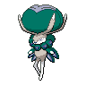

  

  

    

      
Types

      

        
        
      

    

    

      
Abilities

      

        <a href='' title="Opposing Pokemon cannot eat held Berries while this Pokemon is in battle.  Affected Pokemon can still use bug bite or pluck to eat a target's Berry.">Unnerve</a>
        
      

    

  

## Base Stats
<table style="width: 100%">
  <tbody style="width: 100%;">
    <tr style="display: flex; align-items: center;">
      <th style="color: #737373;" >HP</th>
      <td style="border-top: none; width: 70px">100</td>
      <td style="width: 100%; min-width: 450px; border-top: none;">
        

        

      </td>
    </tr>
    <tr style="display: flex; align-items: center;">
      <th style="color: #737373;">Attack</th>
      <td style="border-top: none; width: 70px">80</td>
      <td style="width: 100%; min-width: 450px; border-top: none;">
        

        

      </td>
    </tr>
    <tr style="display: flex; align-items: center;">
      <th style="color: #737373;">Defense</th>
      <td style="border-top: none; width: 70px">80</td>
      <td style="width: 100%; min-width: 450px; border-top: none;">
        

        

      </td>
    </tr>
    <tr style="display: flex; align-items: center;">
      <th style="color: #737373;">SP Attack</th>
      <td style="border-top: none; width: 70px">80</td>
      <td style="width: 100%; min-width: 450px; border-top: none;">
        

        

      </td>
    </tr>
    <tr style="display: flex; align-items: center;">
      <th style="color: #737373;">SP Defense</th>
      <td style="border-top: none; width: 70px">80</td>
      <td style="width: 100%; min-width: 450px; border-top: none;">
        

        

      </td>
    </tr>
    <tr style="display: flex; align-items: center;">
      <th style="color: #737373;">Speed</th>
      <td style="border-top: none; width: 70px">80</td>
      <td style="width: 100%; min-width: 450px; border-top: none;">
        

        

      </td>
    </tr>
  </tbody>
</table>

## Moveset

=== "Level Up Moves"
    | Level | Name | Power | Accuracy | PP | Type | Damage Class |
        | -- | -- | -- | -- | -- | -- | -- |
        	| 1 | Astral-barrage | 120 | 100 | 5 |  |  |
	| 1 | Tail-whip | - | 100 | 30 |  |  |
	| 1 | Glacial-lance | 120 | 100 | 5 |  |  |
	| 1 | Disable | - | 100 | 20 |  |  |
	| 1 | Tackle | 40 | 100 | 35 |  |  |
	| 1 | Torment | - | 100 | 15 |  |  |
	| 1 | Pound | 40 | 100 | 35 |  |  |
	| 1 | Growth | - | - | 20 |  |  |
	| 1 | Confusion | 50 | 100 | 25 |  |  |
	| 1 | Double-edge | 120 | 100 | 15 |  |  |
	| 1 | Haze | - | - | 30 |  |  |
	| 1 | Thrash | 120 | 100 | 10 |  |  |
	| 1 | Stomp | 65 | 100 | 20 |  |  |
	| 1 | Mist | - | - | 30 |  |  |
	| 1 | Double-kick | 30 | 100 | 30 |  |  |
	| 1 | Icicle-crash | 85 | 90 | 10 |  |  |
	| 1 | Mega-drain | 40 | 100 | 15 |  |  |
	| 8 | Life-dew | - | - | 10 |  |  |
	| 40 | Aromatherapy | - | - | 5 |  |  |
	| 64 | Leech-seed | - | 90 | 10 |  |  |
	| 72 | Heal-pulse | - | - | 10 |  |  |
	| 88 | Future-sight | 120 | 100 | 10 |  |  |

        

=== "Machine Moves"
    | Machine | Name | Power | Accuracy | PP | Type | Damage Class |
        | -- | -- | -- | -- | -- | -- | -- |
        	| TM114 | Trailblaze | 50 | 100 | 20 |  |  |
	| TR30 | Encore | - | 100 | 5 |  |  |
	| TM21 | Foul-play | 95 | 100 | 15 |  |  |
	| TM97 | Dark-pulse | 80 | 100 | 15 |  |  |
	| TM19 | Giga-drain | 75 | 100 | 10 |  |  |
	| TM39 | Swift | 60 | - | 20 |  |  |
	| TM05 | Rest | - | - | 5 |  |  |
	| TR69 | Zen-headbutt | 80 | 90 | 15 |  |  |
	| TM61 | Will-o-wisp | - | 85 | 15 |  |  |
	| TM44 | Imprison | - | - | 10 |  |  |
	| TM67 | Smart-strike | 70 | - | 10 |  |  |
	| TM04 | Calm-mind | - | - | 20 |  |  |
	| TM08 | Body-slam | 85 | 100 | 15 |  |  |
	| TR96 | Pollen-puff | 90 | 100 | 15 |  |  |
	| TM88 | Sleep-talk | - | - | 10 |  |  |
	| TR68 | Nasty-plot | - | - | 20 |  |  |
	| TR71 | Leaf-storm | 130 | 90 | 5 |  |  |
	| TR53 | Close-combat | 120 | 100 | 5 |  |  |
	| TM86 | Grass-knot | - | 100 | 20 |  |  |
	| TM16 | Icy-wind | 55 | 95 | 15 |  |  |
	| TM29 | Psychic | 90 | 100 | 10 |  |  |
	| TM09 | Bullet-seed | 25 | 100 | 30 |  |  |
	| TR46 | Iron-defense | - | - | 15 |  |  |
	| TR99 | Body-press | 80 | 100 | 10 |  |  |
	| TM92 | Trick-room | - | - | 5 |  |  |
	| TM48 | Skill-swap | - | - | 10 |  |  |
	| TM03 | Helping-hand | - | - | 20 |  |  |
	| TM91 | Psychic-terrain | - | - | 10 |  |  |
	| TM30 | Shadow-ball | 80 | 100 | 15 |  |  |
	| TM53 | Energy-ball | 90 | 100 | 10 |  |  |
	| TM53 | Mud-shot | 55 | 95 | 15 |  |  |
	| TR12 | Agility | - | - | 30 |  |  |
	| TM78 | Bulldoze | 60 | 100 | 20 |  |  |
	| TM26 | Scary-face | - | 100 | 10 |  |  |
	| TR32 | Crunch | 80 | 100 | 15 |  |  |
	| TM45 | Solar-beam | 120 | 100 | 10 |  |  |
	| TM77 | Hex | 65 | 100 | 10 |  |  |
	| TM95 | Snarl | 55 | 95 | 15 |  |  |
	| TM55 | Ice-beam | 90 | 100 | 10 |  |  |
	| TM11 | Sunny-day | - | - | 5 |  |  |
	| TM08 | Substitute | - | - | 10 |  |  |
	| TM16 | Light-screen | - | - | 30 |  |  |
	| TM98 | Stomping-tantrum | 75 | 100 | 10 |  |  |
	| TM20 | Endure | - | - | 10 |  |  |
	| TM39 | Outrage | 120 | 100 | 10 |  |  |
	| TM48 | Hyper-beam | 150 | 90 | 5 |  |  |
	| TM07 | Protect | - | - | 10 |  |  |
	| TM03 | Psyshock | 80 | 100 | 10 |  |  |
	| TM12 | Facade | 70 | 100 | 20 |  |  |
	| TM88 | Grassy-terrain | - | - | 10 |  |  |
	| TM12 | Taunt | - | 100 | 20 |  |  |
	| TM10 | Magical-leaf | 60 | - | 20 |  |  |
	| TR59 | Seed-bomb | 80 | 100 | 15 |  |  |
	| TR38 | Trick | - | 100 | 10 |  |  |
	| TM14 | Blizzard | 110 | 70 | 5 |  |  |
	| TR82 | Stored-power | 20 | 100 | 10 |  |  |
	| TM68 | Giga-impact | 150 | 90 | 5 |  |  |
	| TR79 | Heavy-slam | - | 100 | 10 |  |  |
	| TR29 | Baton-pass | - | - | 40 |  |  |
	| TM35 | Metronome | - | - | 10 |  |  |
	| TM33 | Reflect | - | - | 20 |  |  |
	| TM09 | Take-down | 90 | 85 | 20 |  |  |
	| TM64 | Avalanche | 60 | 100 | 10 |  |  |
	| TM75 | Swords-dance | - | - | 20 |  |  |
	| TM87 | Draining-kiss | 50 | 100 | 10 |  |  |
	| TM86 | Phantom-force | 90 | 100 | 10 |  |  |

        
