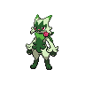

  

  

    

      
Types

      

        
        
      

    

    

      
Abilities

      

        <a href='' title="When this Pokemon has 1/3 or less of its HP remaining, its grass-type moves inflict 1.5x as much regular damage.">Overgrow</a>
        /<a href='' title="Changes the bearer's type to match each move it uses.  The type change takes place just before the move is used.">Protean</a>
      

    

  

## Base Stats
<table style="width: 100%">
  <tbody style="width: 100%;">
    <tr style="display: flex; align-items: center;">
      <th style="color: #737373;" >HP</th>
      <td style="border-top: none; width: 70px">61</td>
      <td style="width: 100%; min-width: 450px; border-top: none;">
        

        

      </td>
    </tr>
    <tr style="display: flex; align-items: center;">
      <th style="color: #737373;">Attack</th>
      <td style="border-top: none; width: 70px">80</td>
      <td style="width: 100%; min-width: 450px; border-top: none;">
        

        

      </td>
    </tr>
    <tr style="display: flex; align-items: center;">
      <th style="color: #737373;">Defense</th>
      <td style="border-top: none; width: 70px">63</td>
      <td style="width: 100%; min-width: 450px; border-top: none;">
        

        

      </td>
    </tr>
    <tr style="display: flex; align-items: center;">
      <th style="color: #737373;">SP Attack</th>
      <td style="border-top: none; width: 70px">60</td>
      <td style="width: 100%; min-width: 450px; border-top: none;">
        

        

      </td>
    </tr>
    <tr style="display: flex; align-items: center;">
      <th style="color: #737373;">SP Defense</th>
      <td style="border-top: none; width: 70px">63</td>
      <td style="width: 100%; min-width: 450px; border-top: none;">
        

        

      </td>
    </tr>
    <tr style="display: flex; align-items: center;">
      <th style="color: #737373;">Speed</th>
      <td style="border-top: none; width: 70px">83</td>
      <td style="width: 100%; min-width: 450px; border-top: none;">
        

        

      </td>
    </tr>
  </tbody>
</table>

## Moveset

=== "Level Up Moves"
    | Level | Name | Power | Accuracy | PP | Type | Damage Class |
        | -- | -- | -- | -- | -- | -- | -- |
        	| 1 | Tail-whip | - | 100 | 30 |  |  |
	| 1 | Leafage | 40 | 100 | 40 |  |  |
	| 1 | Scratch | 40 | 100 | 35 |  |  |
	| 7 | Bite | 60 | 100 | 25 |  |  |
	| 10 | Hone-claws | - | - | 15 |  |  |
	| 15 | Quick-attack | 40 | 100 | 30 |  |  |
	| 28 | Worry-seed | - | 100 | 10 |  |  |
	| 33 | Slash | 70 | 100 | 20 |  |  |

        

=== "Machine Moves"
    | Machine | Name | Power | Accuracy | PP | Type | Damage Class |
        | -- | -- | -- | -- | -- | -- | -- |
        	| TM47 | Low-sweep | 65 | 100 | 20 |  |  |
	| TM114 | Trailblaze | 50 | 100 | 20 |  |  |
	| TM19 | Giga-drain | 75 | 100 | 10 |  |  |
	| TM39 | Swift | 60 | - | 20 |  |  |
	| TM05 | Rest | - | - | 5 |  |  |
	| TM56 | Fling | - | 100 | 10 |  |  |
	| TM62 | Acrobatics | 55 | 100 | 15 |  |  |
	| TM29 | Charm | - | 100 | 20 |  |  |
	| TM88 | Sleep-talk | - | - | 10 |  |  |
	| TR68 | Nasty-plot | - | - | 20 |  |  |
	| TM65 | Shadow-claw | 70 | 100 | 15 |  |  |
	| TM47 | Fake-tears | - | 100 | 20 |  |  |
	| TR71 | Leaf-storm | 130 | 90 | 5 |  |  |
	| TM89 | U-turn | 70 | 100 | 20 |  |  |
	| TM31 | Mud-slap | 20 | 100 | 10 |  |  |
	| TM86 | Grass-knot | - | 100 | 20 |  |  |
	| TM09 | Bullet-seed | 25 | 100 | 30 |  |  |
	| TM03 | Helping-hand | - | - | 20 |  |  |
	| TM44 | Play-rough | 90 | 90 | 10 |  |  |
	| TM53 | Energy-ball | 90 | 100 | 10 |  |  |
	| TM40 | Aerial-ace | 60 | - | 20 |  |  |
	| TR12 | Agility | - | - | 30 |  |  |
	| TM45 | Solar-beam | 120 | 100 | 10 |  |  |
	| TM08 | Substitute | - | - | 10 |  |  |
	| TM136 | Thunder-punch | 75 | 100 | 15 |  |  |
	| TM20 | Endure | - | - | 10 |  |  |
	| TR07 | Low-kick | - | 100 | 20 |  |  |
	| TM07 | Protect | - | - | 10 |  |  |
	| TM12 | Facade | 70 | 100 | 20 |  |  |
	| TM88 | Grassy-terrain | - | - | 10 |  |  |
	| TM12 | Taunt | - | 100 | 20 |  |  |
	| TM10 | Magical-leaf | 60 | - | 20 |  |  |
	| TR59 | Seed-bomb | 80 | 100 | 15 |  |  |
	| TM09 | Take-down | 90 | 85 | 20 |  |  |

        
