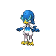

  

  

    

      
Types

      

        
        
      

    

    

      
Abilities

      

        <a href='' title="When this Pokemon has 1/3 or less of its HP remaining, its water-type moves inflict 1.5x as much regular damage.">Torrent</a>
        /<a href='' title="This Pokemon's Attack rises one stage upon knocking out another Pokemon, even a friendly Pokemon.  This ability does not take effect when the Pokemon indirectly causes another Pokemon to faint, e.g. through poison or spikes.  If this Pokemon knocks out a Pokemon with mummy, the former's ability will change without taking effect.">Moxie</a>
      

    

  

## Base Stats
<table style="width: 100%">
  <tbody style="width: 100%;">
    <tr style="display: flex; align-items: center;">
      <th style="color: #737373;" >HP</th>
      <td style="border-top: none; width: 70px">70</td>
      <td style="width: 100%; min-width: 450px; border-top: none;">
        

        

      </td>
    </tr>
    <tr style="display: flex; align-items: center;">
      <th style="color: #737373;">Attack</th>
      <td style="border-top: none; width: 70px">85</td>
      <td style="width: 100%; min-width: 450px; border-top: none;">
        

        

      </td>
    </tr>
    <tr style="display: flex; align-items: center;">
      <th style="color: #737373;">Defense</th>
      <td style="border-top: none; width: 70px">65</td>
      <td style="width: 100%; min-width: 450px; border-top: none;">
        

        

      </td>
    </tr>
    <tr style="display: flex; align-items: center;">
      <th style="color: #737373;">SP Attack</th>
      <td style="border-top: none; width: 70px">65</td>
      <td style="width: 100%; min-width: 450px; border-top: none;">
        

        

      </td>
    </tr>
    <tr style="display: flex; align-items: center;">
      <th style="color: #737373;">SP Defense</th>
      <td style="border-top: none; width: 70px">60</td>
      <td style="width: 100%; min-width: 450px; border-top: none;">
        

        

      </td>
    </tr>
    <tr style="display: flex; align-items: center;">
      <th style="color: #737373;">Speed</th>
      <td style="border-top: none; width: 70px">65</td>
      <td style="width: 100%; min-width: 450px; border-top: none;">
        

        

      </td>
    </tr>
  </tbody>
</table>

## Moveset

=== "Level Up Moves"
    | Level | Name | Power | Accuracy | PP | Type | Damage Class |
        | -- | -- | -- | -- | -- | -- | -- |
        	| 1 | Water-gun | 40 | 100 | 25 |  |  |
	| 1 | Pound | 40 | 100 | 35 |  |  |
	| 1 | Double-hit | 35 | 90 | 10 |  |  |
	| 1 | Growl | - | 100 | 40 |  |  |
	| 7 | Work-up | - | - | 30 |  |  |
	| 10 | Wing-attack | 60 | 100 | 35 |  |  |
	| 13 | Aqua-jet | 40 | 100 | 20 |  |  |
	| 23 | Aqua-cutter | 70 | 100 | 20 |  |  |
	| 32 | Focus-energy | - | - | 30 |  |  |
	| 48 | Feather-dance | - | 100 | 15 |  |  |

        

=== "Machine Moves"
    | Machine | Name | Power | Accuracy | PP | Type | Damage Class |
        | -- | -- | -- | -- | -- | -- | -- |
        	| TM47 | Low-sweep | 65 | 100 | 20 |  |  |
	| TR30 | Encore | - | 100 | 5 |  |  |
	| TM39 | Swift | 60 | - | 20 |  |  |
	| TM05 | Rest | - | - | 5 |  |  |
	| TM115 | Chilling-water | 50 | 100 | 20 |  |  |
	| TM62 | Acrobatics | 55 | 100 | 15 |  |  |
	| TR66 | Brave-bird | 120 | 100 | 15 |  |  |
	| TR98 | Liquidation | 85 | 100 | 10 |  |  |
	| TM03 | Water-pulse | 60 | 100 | 20 |  |  |
	| TR03 | Hydro-pump | 110 | 80 | 5 |  |  |
	| TM95 | Air-slash | 75 | 95 | 15 |  |  |
	| TM03 | Helping-hand | - | - | 20 |  |  |
	| TM40 | Aerial-ace | 60 | - | 20 |  |  |
	| TM89 | Misty-terrain | - | - | 10 |  |  |
	| TM20 | Endure | - | - | 10 |  |  |
	| TR07 | Low-kick | - | 100 | 20 |  |  |
	| TM07 | Protect | - | - | 10 |  |  |
	| TM12 | Facade | 70 | 100 | 20 |  |  |
	| TM18 | Rain-dance | - | - | 5 |  |  |
	| TR29 | Baton-pass | - | - | 40 |  |  |
	| TM09 | Take-down | 90 | 85 | 20 |  |  |
	| TM94 | Surf | 90 | 100 | 15 |  |  |

        
