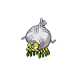

  

  

    

      
Types

      

        
        
      

    

    

      
Abilities

      

        <a href='' title="This Pokemon cannot be asleep.  This causes rest to fail altogether.  If a Pokemon is asleep and acquires this ability, it will immediately wake up; this includes when regaining a lost ability upon leaving battle.  This ability functions identically to vital spirit in battle.">Insomnia</a>
        /<a href='' title="This Pokemon's moves have double power against Pokemon that switched in this turn.">Stakeout</a>
      

    

  

## Base Stats
<table style="width: 100%">
  <tbody style="width: 100%;">
    <tr style="display: flex; align-items: center;">
      <th style="color: #737373;" >HP</th>
      <td style="border-top: none; width: 70px">35</td>
      <td style="width: 100%; min-width: 450px; border-top: none;">
        

        

      </td>
    </tr>
    <tr style="display: flex; align-items: center;">
      <th style="color: #737373;">Attack</th>
      <td style="border-top: none; width: 70px">41</td>
      <td style="width: 100%; min-width: 450px; border-top: none;">
        

        

      </td>
    </tr>
    <tr style="display: flex; align-items: center;">
      <th style="color: #737373;">Defense</th>
      <td style="border-top: none; width: 70px">45</td>
      <td style="width: 100%; min-width: 450px; border-top: none;">
        

        

      </td>
    </tr>
    <tr style="display: flex; align-items: center;">
      <th style="color: #737373;">SP Attack</th>
      <td style="border-top: none; width: 70px">29</td>
      <td style="width: 100%; min-width: 450px; border-top: none;">
        

        

      </td>
    </tr>
    <tr style="display: flex; align-items: center;">
      <th style="color: #737373;">SP Defense</th>
      <td style="border-top: none; width: 70px">40</td>
      <td style="width: 100%; min-width: 450px; border-top: none;">
        

        

      </td>
    </tr>
    <tr style="display: flex; align-items: center;">
      <th style="color: #737373;">Speed</th>
      <td style="border-top: none; width: 70px">20</td>
      <td style="width: 100%; min-width: 450px; border-top: none;">
        

        

      </td>
    </tr>
  </tbody>
</table>

## Moveset

=== "Level Up Moves"
    | Level | Name | Power | Accuracy | PP | Type | Damage Class |
        | -- | -- | -- | -- | -- | -- | -- |
        	| 1 | Tackle | 40 | 100 | 35 |  |  |
	| 1 | String-shot | - | 95 | 40 |  |  |
	| 8 | Assurance | 60 | 100 | 10 |  |  |
	| 11 | Feint | 30 | 100 | 10 |  |  |
	| 14 | Bug-bite | 60 | 100 | 20 |  |  |
	| 18 | Block | - | - | 5 |  |  |
	| 22 | Counter | - | 100 | 20 |  |  |
	| 25 | Headbutt | 70 | 100 | 15 |  |  |
	| 29 | Sticky-web | - | - | 20 |  |  |
	| 33 | Gastro-acid | - | 100 | 10 |  |  |
	| 36 | Circle-throw | 60 | 90 | 10 |  |  |
	| 40 | Throat-chop | 80 | 100 | 15 |  |  |
	| 44 | Skitter-smack | 70 | 90 | 10 |  |  |

        

=== "Machine Moves"
    | Machine | Name | Power | Accuracy | PP | Type | Damage Class |
        | -- | -- | -- | -- | -- | -- | -- |
        	| TM114 | Trailblaze | 50 | 100 | 20 |  |  |
	| TM54 | False-swipe | 40 | 100 | 40 |  |  |
	| TM19 | Giga-drain | 75 | 100 | 10 |  |  |
	| TM05 | Rest | - | - | 5 |  |  |
	| TM84 | Poison-jab | 80 | 100 | 20 |  |  |
	| TM08 | Body-slam | 85 | 100 | 15 |  |  |
	| TM88 | Sleep-talk | - | - | 10 |  |  |
	| TM65 | Shadow-claw | 70 | 100 | 15 |  |  |
	| TM46 | Thief | 60 | 100 | 25 |  |  |
	| TM86 | Grass-knot | - | 100 | 20 |  |  |
	| TM09 | Bullet-seed | 25 | 100 | 30 |  |  |
	| TM117 | Pounce | 50 | 100 | 20 |  |  |
	| TM76 | Struggle-bug | 50 | 100 | 20 |  |  |
	| TR61 | Bug-buzz | 90 | 100 | 10 |  |  |
	| TM28 | Leech-life | 80 | 100 | 10 |  |  |
	| TM11 | Sunny-day | - | - | 5 |  |  |
	| TM08 | Substitute | - | - | 10 |  |  |
	| TM20 | Endure | - | - | 10 |  |  |
	| TM07 | Protect | - | - | 10 |  |  |
	| TM12 | Facade | 70 | 100 | 20 |  |  |
	| TM81 | X-scissor | 80 | 100 | 15 |  |  |
	| TR23 | Spikes | - | - | 20 |  |  |
	| TR54 | Toxic-spikes | - | - | 20 |  |  |
	| TM18 | Rain-dance | - | - | 5 |  |  |
	| TM09 | Take-down | 90 | 85 | 20 |  |  |

        
