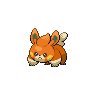

  

  

    

      
Types

      

        
        
      

    

    

      
Abilities

      

        <a href='' title="Whenever a move makes contact with this Pokemon, the move's user has a 30% chance of being paralyzed.  Pokemon that are immune to electric-type moves can still be paralyzed by this ability.  Overworld: If the lead Pokemon has this ability, there is a 50% chance that encounters will be with an electric Pokemon, if applicable.">Static</a>
        /<a href='' title="This Pokemon is cured of any major status ailment when it is switched out for another Pokemon.  If this ability is acquired during battle, the Pokemon is cured upon leaving battle before losing the temporary ability.">Natural-cure</a>
      

    

  

## Base Stats
<table style="width: 100%">
  <tbody style="width: 100%;">
    <tr style="display: flex; align-items: center;">
      <th style="color: #737373;" >HP</th>
      <td style="border-top: none; width: 70px">45</td>
      <td style="width: 100%; min-width: 450px; border-top: none;">
        

        

      </td>
    </tr>
    <tr style="display: flex; align-items: center;">
      <th style="color: #737373;">Attack</th>
      <td style="border-top: none; width: 70px">50</td>
      <td style="width: 100%; min-width: 450px; border-top: none;">
        

        

      </td>
    </tr>
    <tr style="display: flex; align-items: center;">
      <th style="color: #737373;">Defense</th>
      <td style="border-top: none; width: 70px">20</td>
      <td style="width: 100%; min-width: 450px; border-top: none;">
        

        

      </td>
    </tr>
    <tr style="display: flex; align-items: center;">
      <th style="color: #737373;">SP Attack</th>
      <td style="border-top: none; width: 70px">40</td>
      <td style="width: 100%; min-width: 450px; border-top: none;">
        

        

      </td>
    </tr>
    <tr style="display: flex; align-items: center;">
      <th style="color: #737373;">SP Defense</th>
      <td style="border-top: none; width: 70px">25</td>
      <td style="width: 100%; min-width: 450px; border-top: none;">
        

        

      </td>
    </tr>
    <tr style="display: flex; align-items: center;">
      <th style="color: #737373;">Speed</th>
      <td style="border-top: none; width: 70px">60</td>
      <td style="width: 100%; min-width: 450px; border-top: none;">
        

        

      </td>
    </tr>
  </tbody>
</table>

## Moveset

=== "Level Up Moves"
    | Level | Name | Power | Accuracy | PP | Type | Damage Class |
        | -- | -- | -- | -- | -- | -- | -- |
        	| 1 | Scratch | 40 | 100 | 35 |  |  |
	| 1 | Growl | - | 100 | 40 |  |  |
	| 3 | Thunder-shock | 40 | 100 | 30 |  |  |
	| 6 | Quick-attack | 40 | 100 | 30 |  |  |
	| 8 | Charge | - | - | 20 |  |  |
	| 12 | Nuzzle | 20 | 100 | 20 |  |  |
	| 19 | Bite | 60 | 100 | 25 |  |  |
	| 23 | Spark | 65 | 100 | 20 |  |  |
	| 31 | Entrainment | - | 100 | 15 |  |  |
	| 35 | Slam | 80 | 75 | 20 |  |  |
	| 38 | Discharge | 80 | 100 | 15 |  |  |

        

=== "Machine Moves"
    | Machine | Name | Power | Accuracy | PP | Type | Damage Class |
        | -- | -- | -- | -- | -- | -- | -- |
        	| TR30 | Encore | - | 100 | 5 |  |  |
	| TM36 | Thunderbolt | 90 | 100 | 15 |  |  |
	| TM93 | Eerie-impulse | - | 100 | 15 |  |  |
	| TM39 | Swift | 60 | - | 20 |  |  |
	| TM05 | Rest | - | - | 5 |  |  |
	| TM56 | Fling | - | 100 | 10 |  |  |
	| TM38 | Thunder | 110 | 70 | 10 |  |  |
	| TM29 | Charm | - | 100 | 20 |  |  |
	| TM88 | Sleep-talk | - | - | 10 |  |  |
	| TM46 | Thief | 60 | 100 | 25 |  |  |
	| TR80 | Electro-ball | - | 100 | 10 |  |  |
	| TM130 | Thunder-fang | 65 | 95 | 15 |  |  |
	| TM10 | Dig | 80 | 100 | 10 |  |  |
	| TM03 | Helping-hand | - | - | 20 |  |  |
	| TM44 | Play-rough | 90 | 90 | 10 |  |  |
	| TR12 | Agility | - | - | 30 |  |  |
	| TM90 | Electric-terrain | - | - | 10 |  |  |
	| TM57 | Charge-beam | 50 | 90 | 10 |  |  |
	| TR32 | Crunch | 80 | 100 | 15 |  |  |
	| TM11 | Sunny-day | - | - | 5 |  |  |
	| TM08 | Substitute | - | - | 10 |  |  |
	| TM72 | Volt-switch | 70 | 100 | 20 |  |  |
	| TM93 | Wild-charge | 90 | 100 | 15 |  |  |
	| TM20 | Endure | - | - | 10 |  |  |
	| TM07 | Protect | - | - | 10 |  |  |
	| TM12 | Facade | 70 | 100 | 20 |  |  |
	| TM18 | Rain-dance | - | - | 5 |  |  |
	| TR29 | Baton-pass | - | - | 40 |  |  |
	| TM09 | Take-down | 90 | 85 | 20 |  |  |
	| TM16 | Thunder-wave | - | 90 | 20 |  |  |

        
