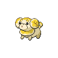

  

  

    

      
Types

      

        
        
      

    

    

      
Abilities

      

        <a href='' title="This Pokemon cannot be confused.  If a Pokemon is confused and acquires this ability, its confusion will immediately be healed.">Own-tempo</a>
        /<a href='' title="In battle, this Pokemon cannot use its held item, nor will the item have any passive effect on the battle, positive or negative.  This Pokemon also cannot use fling.  The Speed cut from the iron ball and the effort items (the macho brace, power weight, power bracer, power belt, power lens, power band, and power anklet) is unaffected.  Items that do not directly affect the battle, such as the exp share, the amulet coin, or the soothe bell, work as usual.  All held items work as usual out of battle.  Other moves that use the held item, such as natural gift and switcheroo, work as usual.">Klutz</a>
      

    

  

## Base Stats
<table style="width: 100%">
  <tbody style="width: 100%;">
    <tr style="display: flex; align-items: center;">
      <th style="color: #737373;" >HP</th>
      <td style="border-top: none; width: 70px">37</td>
      <td style="width: 100%; min-width: 450px; border-top: none;">
        

        

      </td>
    </tr>
    <tr style="display: flex; align-items: center;">
      <th style="color: #737373;">Attack</th>
      <td style="border-top: none; width: 70px">55</td>
      <td style="width: 100%; min-width: 450px; border-top: none;">
        

        

      </td>
    </tr>
    <tr style="display: flex; align-items: center;">
      <th style="color: #737373;">Defense</th>
      <td style="border-top: none; width: 70px">70</td>
      <td style="width: 100%; min-width: 450px; border-top: none;">
        

        

      </td>
    </tr>
    <tr style="display: flex; align-items: center;">
      <th style="color: #737373;">SP Attack</th>
      <td style="border-top: none; width: 70px">30</td>
      <td style="width: 100%; min-width: 450px; border-top: none;">
        

        

      </td>
    </tr>
    <tr style="display: flex; align-items: center;">
      <th style="color: #737373;">SP Defense</th>
      <td style="border-top: none; width: 70px">55</td>
      <td style="width: 100%; min-width: 450px; border-top: none;">
        

        

      </td>
    </tr>
    <tr style="display: flex; align-items: center;">
      <th style="color: #737373;">Speed</th>
      <td style="border-top: none; width: 70px">65</td>
      <td style="width: 100%; min-width: 450px; border-top: none;">
        

        

      </td>
    </tr>
  </tbody>
</table>

## Moveset

=== "Level Up Moves"
    | Level | Name | Power | Accuracy | PP | Type | Damage Class |
        | -- | -- | -- | -- | -- | -- | -- |
        	| 1 | Tackle | 40 | 100 | 35 |  |  |
	| 1 | Growl | - | 100 | 40 |  |  |
	| 3 | Lick | 30 | 100 | 30 |  |  |
	| 6 | Tail-whip | - | 100 | 30 |  |  |
	| 8 | Covet | 60 | 100 | 25 |  |  |
	| 11 | Bite | 60 | 100 | 25 |  |  |
	| 15 | Baby-doll-eyes | - | 100 | 30 |  |  |
	| 22 | Work-up | - | - | 30 |  |  |
	| 30 | Roar | - | - | 20 |  |  |
	| 33 | Double-edge | 120 | 100 | 15 |  |  |
	| 45 | Last-resort | 140 | 100 | 5 |  |  |

        

=== "Machine Moves"
    | Machine | Name | Power | Accuracy | PP | Type | Damage Class |
        | -- | -- | -- | -- | -- | -- | -- |
        	| TM114 | Trailblaze | 50 | 100 | 20 |  |  |
	| TM05 | Rest | - | - | 5 |  |  |
	| TM29 | Charm | - | 100 | 20 |  |  |
	| TM08 | Body-slam | 85 | 100 | 15 |  |  |
	| TM88 | Sleep-talk | - | - | 10 |  |  |
	| TM130 | Thunder-fang | 65 | 95 | 15 |  |  |
	| TM10 | Dig | 80 | 100 | 10 |  |  |
	| TM31 | Mud-slap | 20 | 100 | 10 |  |  |
	| TM03 | Helping-hand | - | - | 20 |  |  |
	| TM44 | Play-rough | 90 | 90 | 10 |  |  |
	| TR97 | Psychic-fangs | 85 | 100 | 10 |  |  |
	| TM53 | Mud-shot | 55 | 95 | 15 |  |  |
	| TR12 | Agility | - | - | 30 |  |  |
	| TM99 | Dazzling-gleam | 80 | 100 | 10 |  |  |
	| TM126 | Fire-fang | 65 | 95 | 15 |  |  |
	| TM89 | Misty-terrain | - | - | 10 |  |  |
	| TR32 | Crunch | 80 | 100 | 15 |  |  |
	| TM128 | Ice-fang | 65 | 95 | 15 |  |  |
	| TM95 | Snarl | 55 | 95 | 15 |  |  |
	| TM11 | Sunny-day | - | - | 5 |  |  |
	| TM08 | Substitute | - | - | 10 |  |  |
	| TM98 | Stomping-tantrum | 75 | 100 | 10 |  |  |
	| TM20 | Endure | - | - | 10 |  |  |
	| TM07 | Protect | - | - | 10 |  |  |
	| TM12 | Facade | 70 | 100 | 20 |  |  |
	| TM18 | Rain-dance | - | - | 5 |  |  |
	| TR29 | Baton-pass | - | - | 40 |  |  |
	| TM09 | Take-down | 90 | 85 | 20 |  |  |

        
