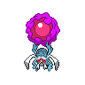

  

  

    

      
Types

      

        
        
      

    

    

      
Abilities

      

        <a href='' title="Whenever this Pokemon is burned, paralyzed, or poisoned, the Pokemon who gave this Pokemon that ailment is also given the ailment.  This ability passes back bad poison when this Pokemon is badly poisoned.  This ability cannot pass on a status ailment that the Pokemon did not directly receive from another Pokemon, such as the poison from toxic spikes or the burn from a flame orb.  Overworld: If the lead Pokemon has this ability, wild Pokemon have a 50% chance of having the lead Pokemon's nature, and a 50% chance of being given a random nature as usual, including the lead Pokemon's nature.  This does not work on Pokemon received outside of battle or roaming legendaries.">Synchronize</a>
        /<a href='' title="This Pokemon does not take damage from friendly Pokemon's moves, including single-target moves aimed at it.">Telepathy</a>
      

    

  

## Base Stats
<table style="width: 100%">
  <tbody style="width: 100%;">
    <tr style="display: flex; align-items: center;">
      <th style="color: #737373;" >HP</th>
      <td style="border-top: none; width: 70px">75</td>
      <td style="width: 100%; min-width: 450px; border-top: none;">
        

        

      </td>
    </tr>
    <tr style="display: flex; align-items: center;">
      <th style="color: #737373;">Attack</th>
      <td style="border-top: none; width: 70px">50</td>
      <td style="width: 100%; min-width: 450px; border-top: none;">
        

        

      </td>
    </tr>
    <tr style="display: flex; align-items: center;">
      <th style="color: #737373;">Defense</th>
      <td style="border-top: none; width: 70px">85</td>
      <td style="width: 100%; min-width: 450px; border-top: none;">
        

        

      </td>
    </tr>
    <tr style="display: flex; align-items: center;">
      <th style="color: #737373;">SP Attack</th>
      <td style="border-top: none; width: 70px">115</td>
      <td style="width: 100%; min-width: 450px; border-top: none;">
        

        

      </td>
    </tr>
    <tr style="display: flex; align-items: center;">
      <th style="color: #737373;">SP Defense</th>
      <td style="border-top: none; width: 70px">100</td>
      <td style="width: 100%; min-width: 450px; border-top: none;">
        

        

      </td>
    </tr>
    <tr style="display: flex; align-items: center;">
      <th style="color: #737373;">Speed</th>
      <td style="border-top: none; width: 70px">45</td>
      <td style="width: 100%; min-width: 450px; border-top: none;">
        

        

      </td>
    </tr>
  </tbody>
</table>

## Moveset

=== "Level Up Moves"
    | Level | Name | Power | Accuracy | PP | Type | Damage Class |
        | -- | -- | -- | -- | -- | -- | -- |
        	| 1 | Tackle | 40 | 100 | 35 |  |  |
	| 1 | Defense-curl | - | - | 40 |  |  |
	| 1 | Confusion | 50 | 100 | 25 |  |  |
	| 4 | Sand-attack | - | 100 | 15 |  |  |
	| 11 | Rollout | 30 | 90 | 20 |  |  |
	| 20 | Bug-bite | 60 | 100 | 20 |  |  |
	| 29 | Extrasensory | 80 | 100 | 20 |  |  |
	| 35 | Lunge | 80 | 100 | 15 |  |  |
	| 40 | Guard-swap | - | - | 10 |  |  |
	| 40 | Speed-swap | - | - | 10 |  |  |
	| 40 | Power-swap | - | - | 10 |  |  |

        

=== "Machine Moves"
    | Machine | Name | Power | Accuracy | PP | Type | Damage Class |
        | -- | -- | -- | -- | -- | -- | -- |
        	| TR73 | Gunk-shot | 120 | 80 | 5 |  |  |
	| TM05 | Rest | - | - | 5 |  |  |
	| TM56 | Fling | - | 100 | 10 |  |  |
	| TM36 | Sludge-bomb | 90 | 100 | 10 |  |  |
	| TR67 | Earth-power | 90 | 100 | 10 |  |  |
	| TR69 | Zen-headbutt | 80 | 90 | 15 |  |  |
	| TM44 | Imprison | - | - | 10 |  |  |
	| TM04 | Calm-mind | - | - | 20 |  |  |
	| TM88 | Sleep-talk | - | - | 10 |  |  |
	| TM46 | Thief | 60 | 100 | 25 |  |  |
	| TM39 | Rock-tomb | 60 | 95 | 15 |  |  |
	| TR80 | Electro-ball | - | 100 | 10 |  |  |
	| TM10 | Dig | 80 | 100 | 10 |  |  |
	| TM31 | Mud-slap | 20 | 100 | 10 |  |  |
	| TM29 | Psychic | 90 | 100 | 10 |  |  |
	| TR46 | Iron-defense | - | - | 15 |  |  |
	| TM117 | Pounce | 50 | 100 | 20 |  |  |
	| TM92 | Trick-room | - | - | 5 |  |  |
	| TM48 | Skill-swap | - | - | 10 |  |  |
	| TM91 | Psychic-terrain | - | - | 10 |  |  |
	| TM30 | Shadow-ball | 80 | 100 | 15 |  |  |
	| TM53 | Energy-ball | 90 | 100 | 10 |  |  |
	| TM76 | Struggle-bug | 50 | 100 | 20 |  |  |
	| TM53 | Mud-shot | 55 | 95 | 15 |  |  |
	| TM99 | Dazzling-gleam | 80 | 100 | 10 |  |  |
	| TM37 | Sandstorm | - | - | 10 |  |  |
	| TR61 | Bug-buzz | 90 | 100 | 10 |  |  |
	| TM28 | Leech-life | 80 | 100 | 10 |  |  |
	| TM11 | Sunny-day | - | - | 5 |  |  |
	| TM08 | Substitute | - | - | 10 |  |  |
	| TM16 | Light-screen | - | - | 30 |  |  |
	| TM20 | Endure | - | - | 10 |  |  |
	| TM48 | Hyper-beam | 150 | 90 | 5 |  |  |
	| TM07 | Protect | - | - | 10 |  |  |
	| TM03 | Psyshock | 80 | 100 | 10 |  |  |
	| TR63 | Power-gem | 80 | 100 | 20 |  |  |
	| TM12 | Facade | 70 | 100 | 20 |  |  |
	| TM81 | X-scissor | 80 | 100 | 15 |  |  |
	| TR38 | Trick | - | 100 | 10 |  |  |
	| TR82 | Stored-power | 20 | 100 | 10 |  |  |
	| TM18 | Rain-dance | - | - | 5 |  |  |
	| TM68 | Giga-impact | 150 | 90 | 5 |  |  |
	| TM33 | Reflect | - | - | 20 |  |  |
	| TM09 | Take-down | 90 | 85 | 20 |  |  |

        
