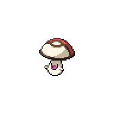
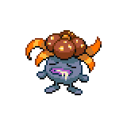
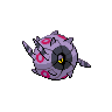
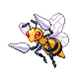
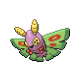
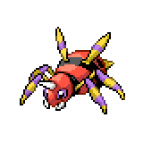
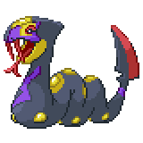

=== "Wild Encounters"

	???+ note "Grass Lv. 23-26"
		

                     [Foongus](/pokemon-umbral-stasis/pokemon/590-foongus) 20%
                

                     [Gloom](/pokemon-umbral-stasis/pokemon/044-gloom) 20%
                

                     [Whirlipede](/pokemon-umbral-stasis/pokemon/544-whirlipede) 15%
                

                     [Beedrill](/pokemon-umbral-stasis/pokemon/015-beedrill) 15%
                

                     [Dustox](/pokemon-umbral-stasis/pokemon/269-dustox) 15%
                

                     [Ariados](/pokemon-umbral-stasis/pokemon/168-ariados) 10%
                

                     [Seviper](/pokemon-umbral-stasis/pokemon/336-seviper) 5%
                

