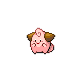

=== "Wild Encounters"

	???+ note "Grass Lv. 1-5"
		

                     [Chingling](/pokemon-umbral-stasis/pokemon/433-chingling) 20%
                

                     [Azurill](/pokemon-umbral-stasis/pokemon/298-azurill) 20%
                

                     [Cleffa](/pokemon-umbral-stasis/pokemon/173-cleffa) 15%
                

                     [Pichu](/pokemon-umbral-stasis/pokemon/172-pichu) 15%
                

                     [Happiny](/pokemon-umbral-stasis/pokemon/440-happiny) 15%
                

                     [Igglybuff](/pokemon-umbral-stasis/pokemon/174-igglybuff) 15%
                

	???+ note "Old Rod Lv. 1-5"
		

                     [Mantyke](/pokemon-umbral-stasis/pokemon/458-mantyke) 100%
                

