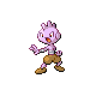
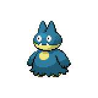
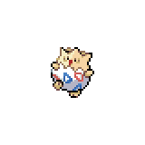
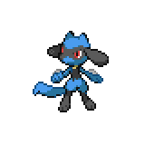

=== "Wild Encounters"

	???+ note "Grass Lv. 1-5"
		

                     [Tyrogue](/pokemon-umbral-stasis/pokemon/236-tyrogue) 30%
                

                     [Wynaut](/pokemon-umbral-stasis/pokemon/360-wynaut) 30%
                

                     [Munchlax](/pokemon-umbral-stasis/pokemon/446-munchlax) 20%
                

                     [Togepi](/pokemon-umbral-stasis/pokemon/175-togepi) 10%
                

                     [Riolu](/pokemon-umbral-stasis/pokemon/447-riolu) 10%
                

