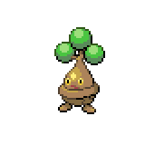
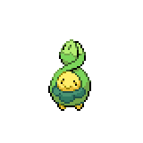
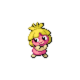
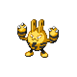
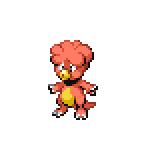

=== "Wild Encounters"

	???+ note "Grass Lv. 1-5"
		

                     [Mime-jr](/pokemon-umbral-stasis/pokemon/439-mime-jr) 25%
                

                     [Bonsly](/pokemon-umbral-stasis/pokemon/438-bonsly) 25%
                

                     [Budew](/pokemon-umbral-stasis/pokemon/406-budew) 20%
                

                     [Smoochum](/pokemon-umbral-stasis/pokemon/238-smoochum) 10%
                

                     [Elekid](/pokemon-umbral-stasis/pokemon/239-elekid) 10%
                

                     [Magby](/pokemon-umbral-stasis/pokemon/240-magby) 10%
                

