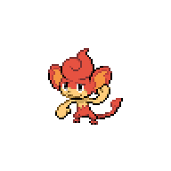
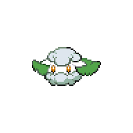

=== "Wild Encounters"

	???+ note "Grass Lv. 6-9"
		

                     [Panpour](/pokemon-umbral-stasis/pokemon/515-panpour) 25%
                

                     [Pansage](/pokemon-umbral-stasis/pokemon/511-pansage) 25%
                

                     [Pansear](/pokemon-umbral-stasis/pokemon/513-pansear) 25%
                

                     [Budew](/pokemon-umbral-stasis/pokemon/406-budew) 20%
                

                     [Cottonee](/pokemon-umbral-stasis/pokemon/546-cottonee) 5%
                

