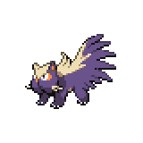

=== "Wild Encounters"

	???+ note "Grass Lv. 5-9"
		

                     [Wurmple](/pokemon-umbral-stasis/pokemon/265-wurmple) 20%
                

                     [Caterpie](/pokemon-umbral-stasis/pokemon/010-caterpie) 20%
                

                     [Weedle](/pokemon-umbral-stasis/pokemon/013-weedle) 20%
                

                     [Paras](/pokemon-umbral-stasis/pokemon/046-paras) 15%
                

                     [Ekans](/pokemon-umbral-stasis/pokemon/023-ekans) 10%
                

                     [Stunky](/pokemon-umbral-stasis/pokemon/441-stunky) 10%
                

                     [Hoothoot](/pokemon-umbral-stasis/pokemon/163-hoothoot) 5%
                

