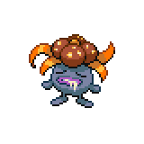
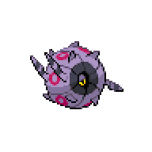
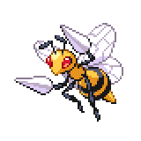
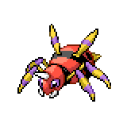
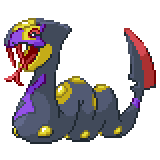

=== "Wild Encounters"

	???+ note "Grass Lv. 23-28"
		

                     [Foongus](/pokemon-umbral-stasis/pokemon/590-foongus) 20%
                

                     [Gloom](/pokemon-umbral-stasis/pokemon/044-gloom) 20%
                

                     [Whirlipede](/pokemon-umbral-stasis/pokemon/049-whirlipede) 15%
                

                     [Beedrill](/pokemon-umbral-stasis/pokemon/022-beedrill) 15%
                

                     [Dustox](/pokemon-umbral-stasis/pokemon/027-dustox) 15%
                

                     [Ariados](/pokemon-umbral-stasis/pokemon/041-ariados) 10%
                

                     [Seviper](/pokemon-umbral-stasis/pokemon/336-seviper) 5%
                

	???+ note "Special Lv. 15"
		

                     [Venipede](/pokemon-umbral-stasis/pokemon/048-venipede) 100%
                

