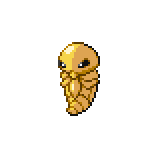
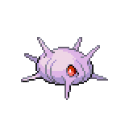
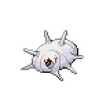
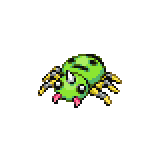
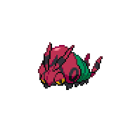
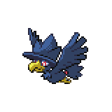

=== "Wild Encounters"

	???+ note "Grass Lv. 9-11"
		

                     [Metapod](/pokemon-umbral-stasis/pokemon/018-metapod) 18%
                

                     [Kakuna](/pokemon-umbral-stasis/pokemon/021-kakuna) 18%
                

                     [Cascoon](/pokemon-umbral-stasis/pokemon/026-cascoon) 18%
                

                     [Silcoon](/pokemon-umbral-stasis/pokemon/024-silcoon) 18%
                

                     [Spinarak](/pokemon-umbral-stasis/pokemon/040-spinarak) 10%
                

                     [Poochyena](/pokemon-umbral-stasis/pokemon/042-poochyena) 8%
                

                     [Venipede](/pokemon-umbral-stasis/pokemon/048-venipede) 5%
                

                     [Murkrow](/pokemon-umbral-stasis/pokemon/198-murkrow) 5%
                

