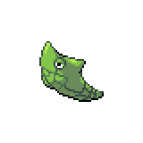

=== "Wild Encounters"

	???+ note "Grass Lv. 9-11"
		

                     [Metapod](/pokemon-umbral-stasis/pokemon/011-metapod) 18%
                

                     [Kakuna](/pokemon-umbral-stasis/pokemon/014-kakuna) 18%
                

                     [Cascoon](/pokemon-umbral-stasis/pokemon/268-cascoon) 18%
                

                     [Silcoon](/pokemon-umbral-stasis/pokemon/266-silcoon) 18%
                

                     [Spinarak](/pokemon-umbral-stasis/pokemon/167-spinarak) 10%
                

                     [Poochyena](/pokemon-umbral-stasis/pokemon/261-poochyena) 8%
                

                     [Venipede](/pokemon-umbral-stasis/pokemon/559-venipede) 5%
                

                     [Murkrow](/pokemon-umbral-stasis/pokemon/198-murkrow) 5%
                

