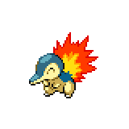
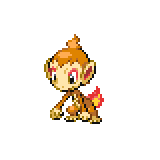
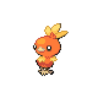
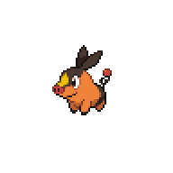

=== "Wild Encounters"

	???+ note "Grass Lv. 5-15"
		

                     [Cyndaquil](/pokemon-umbral-stasis/pokemon/155-cyndaquil) 20%
                

                     [Chimchar](/pokemon-umbral-stasis/pokemon/390-chimchar) 20%
                

                     [Charmander](/pokemon-umbral-stasis/pokemon/004-charmander) 20%
                

                     [Torchic](/pokemon-umbral-stasis/pokemon/255-torchic) 20%
                

                     [Tepig](/pokemon-umbral-stasis/pokemon/498-tepig) 20%
                

