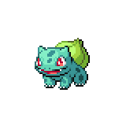
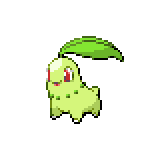
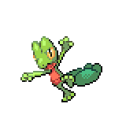

=== "Wild Encounters"

	???+ note "Grass Lv. 5-15"
		

                     [Turtwig](/pokemon-umbral-stasis/pokemon/387-turtwig) 20%
                

                     [Snivy](/pokemon-umbral-stasis/pokemon/495-snivy) 20%
                

                     [Bulbasaur](/pokemon-umbral-stasis/pokemon/001-bulbasaur) 20%
                

                     [Chikorita](/pokemon-umbral-stasis/pokemon/152-chikorita) 20%
                

                     [Treecko](/pokemon-umbral-stasis/pokemon/252-treecko) 20%
                

