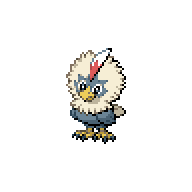
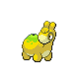
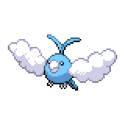
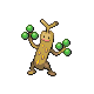
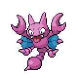
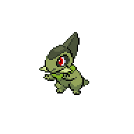

=== "Wild Encounters"

	???+ note "Grass Lv. 30-34"
		

                     [Rufflet](/pokemon-umbral-stasis/pokemon/627-rufflet) 25%
                

                     [Numel](/pokemon-umbral-stasis/pokemon/322-numel) 25%
                

                     [Swablu](/pokemon-umbral-stasis/pokemon/333-swablu) 20%
                

                     [Sudowoodo](/pokemon-umbral-stasis/pokemon/185-sudowoodo) 15%
                

                     [Gligar](/pokemon-umbral-stasis/pokemon/207-gligar) 10%
                

                     [Axew](/pokemon-umbral-stasis/pokemon/610-axew) 5%
                

