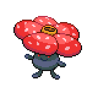
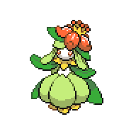
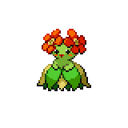
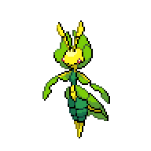
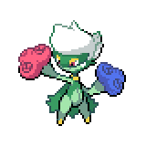

=== "Wild Encounters"

	???+ note "Grass Lv. 60-80"
		

                     [Vileplume](/pokemon-umbral-stasis/pokemon/045-vileplume) 10%
                

                     [Sunflora](/pokemon-umbral-stasis/pokemon/192-sunflora) 10%
                

                     [Lilligant](/pokemon-umbral-stasis/pokemon/549-lilligant) 10%
                

                     [Exeggutor](/pokemon-umbral-stasis/pokemon/103-exeggutor) 10%
                

                     [Bellossom](/pokemon-umbral-stasis/pokemon/182-bellossom) 10%
                

                     [Leavanny](/pokemon-umbral-stasis/pokemon/542-leavanny) 10%
                

                     [Roserade](/pokemon-umbral-stasis/pokemon/407-roserade) 10%
                

                     [Victreebel](/pokemon-umbral-stasis/pokemon/071-victreebel) 10%
                

	???+ note "Special Lv. 50"
		

                     [Shaymin](/pokemon-umbral-stasis/pokemon/492-shaymin) 100%
                

