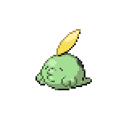
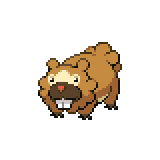
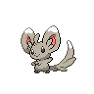
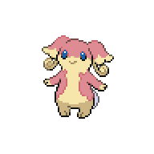
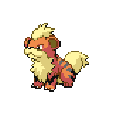

=== "Wild Encounters"

	???+ note "Grass Lv. 22-25"
		

                     [Gulpin](/pokemon-umbral-stasis/pokemon/316-gulpin) 20%
                

                     [Bidoof](/pokemon-umbral-stasis/pokemon/399-bidoof) 20%
                

                     [Glameow](/pokemon-umbral-stasis/pokemon/431-glameow) 20%
                

                     [Minccino](/pokemon-umbral-stasis/pokemon/572-minccino) 15%
                

                     [Audino](/pokemon-umbral-stasis/pokemon/531-audino) 10%
                

                     [Munna](/pokemon-umbral-stasis/pokemon/517-munna) 10%
                

                     [Growlithe](/pokemon-umbral-stasis/pokemon/058-growlithe) 5%
                

