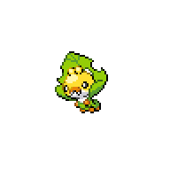
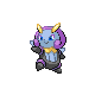
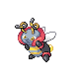
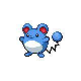
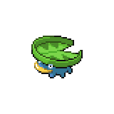
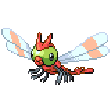
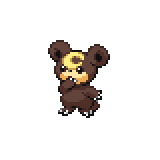

=== "Wild Encounters"

	???+ note "Grass Lv. 16-20"
		

                     [Sewaddle](/pokemon-umbral-stasis/pokemon/540-sewaddle) 20%
                

                     [Illumise](/pokemon-umbral-stasis/pokemon/314-illumise) 20%
                

                     [Volbeat](/pokemon-umbral-stasis/pokemon/313-volbeat) 20%
                

                     [Marill](/pokemon-umbral-stasis/pokemon/183-marill) 15%
                

                     [Lotad](/pokemon-umbral-stasis/pokemon/270-lotad) 15%
                

                     [Yanma](/pokemon-umbral-stasis/pokemon/193-yanma) 10%
                

                     [Teddiursa](/pokemon-umbral-stasis/pokemon/216-teddiursa) 10%
                

                     [Munchlax](/pokemon-umbral-stasis/pokemon/446-munchlax) 5%
                

