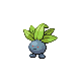
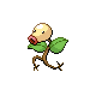
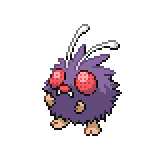
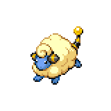
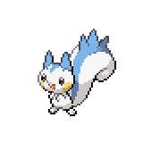
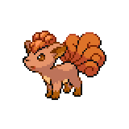
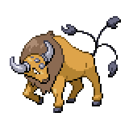

=== "Wild Encounters"

	???+ note "Grass Lv. 12-16"
		

                     [Oddish](/pokemon-umbral-stasis/pokemon/043-oddish) 25%
                

                     [Bellsprout](/pokemon-umbral-stasis/pokemon/069-bellsprout) 25%
                

                     [Venonat](/pokemon-umbral-stasis/pokemon/048-venonat) 25%
                

                     [Mareep](/pokemon-umbral-stasis/pokemon/179-mareep) 10%
                

                     [Pachirisu](/pokemon-umbral-stasis/pokemon/424-pachirisu) 10%
                

                     [Vulpix](/pokemon-umbral-stasis/pokemon/037-vulpix) 5%
                

	???+ note "Special Lv. 20"
		

                     [Tauros](/pokemon-umbral-stasis/pokemon/128-tauros) 100%
                

