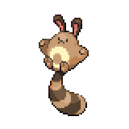

=== "Wild Encounters"

	???+ note "Grass Lv. 4-6"
		

                     [Taillow](/pokemon-umbral-stasis/pokemon/276-taillow) 18%
                

                     [Sentret](/pokemon-umbral-stasis/pokemon/161-sentret) 18%
                

                     [Pidgey](/pokemon-umbral-stasis/pokemon/016-pidgey) 18%
                

                     [Starly](/pokemon-umbral-stasis/pokemon/399-starly) 18%
                

                     [Zigzagoon](/pokemon-umbral-stasis/pokemon/263-zigzagoon) 18%
                

                     [Buneary](/pokemon-umbral-stasis/pokemon/434-buneary) 10%
                

=== "Trainer Encounters"

	
	???+ note "Youngster Ben"
		

		

		  

		    
		    

		      <a href="/route-testing/pokemon/016-pidgey">Pidgey</a>
		      Lv 6
		    

		  

		  

		    

		      
		      
		    

		    

		      
Ability:

		      -
		    

		    

		      
Nature:

		      -
		    

		    

		      
Held Item:

		      

		        

		        -
		      

		    

		  

		  

		    
-

		    
-

		    
-

		    
-

		  

		
		

		  

		    
		    

		      <a href="/route-testing/pokemon/161-sentret">Sentret</a>
		      Lv 7
		    

		  

		  

		    

		      
		      

		    

		    

		      
Ability:

		      -
		    

		    

		      
Nature:

		      -
		    

		    

		      
Held Item:

		      

		        

		        -
		      

		    

		  

		  

		    
-

		    
-

		    
-

		    
-

		  

		

	
	???+ note "Aroma Lady Amy"
		

		

		  

		    
		    

		      <a href="/route-testing/pokemon/434-buneary">Buneary</a>
		      Lv 7
		    

		  

		  

		    

		      
		      

		    

		    

		      
Ability:

		      -
		    

		    

		      
Nature:

		      -
		    

		    

		      
Held Item:

		      

		        

		        -
		      

		    

		  

		  

		    
-

		    
-

		    
-

		    
-

		  

		
		

		  

		    
		    

		      <a href="/route-testing/pokemon/399-starly">Starly</a>
		      Lv 7
		    

		  

		  

		    

		      
		      
		    

		    

		      
Ability:

		      -
		    

		    

		      
Nature:

		      -
		    

		    

		      
Held Item:

		      

		        

		        -
		      

		    

		  

		  

		    
-

		    
-

		    
-

		    
-

		  

		

	
	???+ note "Youngster Tim"
		

		

		  

		    
		    

		      <a href="/route-testing/pokemon/276-taillow">Taillow</a>
		      Lv 6
		    

		  

		  

		    

		      
		      
		    

		    

		      
Ability:

		      -
		    

		    

		      
Nature:

		      -
		    

		    

		      
Held Item:

		      

		        

		        -
		      

		    

		  

		  

		    
-

		    
-

		    
-

		    
-

		  

		
		

		  

		    
		    

		      <a href="/route-testing/pokemon/263-zigzagoon">Zigzagoon</a>
		      Lv 7
		    

		  

		  

		    

		      
		      

		    

		    

		      
Ability:

		      -
		    

		    

		      
Nature:

		      -
		    

		    

		      
Held Item:

		      

		        

		        -
		      

		    

		  

		  

		    
-

		    
-

		    
-

		    
-

		  

		

	
	???+ note "Lady Aurora"
		

		

		  

		    
		    

		      <a href="/route-testing/pokemon/161-sentret">Sentret</a>
		      Lv 7
		    

		  

		  

		    

		      
		      

		    

		    

		      
Ability:

		      -
		    

		    

		      
Nature:

		      -
		    

		    

		      
Held Item:

		      

		        

		        -
		      

		    

		  

		  

		    
-

		    
-

		    
-

		    
-

		  

		
		

		  

		    
		    

		      <a href="/route-testing/pokemon/025-pikachu">Pikachu</a>
		      Lv 8
		    

		  

		  

		    

		      
		      

		    

		    

		      
Ability:

		      -
		    

		    

		      
Nature:

		      -
		    

		    

		      
Held Item:

		      

		        

		        -
		      

		    

		  

		  

		    
-

		    
-

		    
-

		    
-

		  

		

