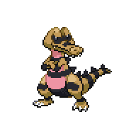

=== "Wild Encounters"

	???+ note "Sand Lv. 38-42"
		

                     [Krokorok](/pokemon-umbral-stasis/pokemon/552-krokorok) 20%
                

                     [Claydol](/pokemon-umbral-stasis/pokemon/344-claydol) 20%
                

                     [Cacturne](/pokemon-umbral-stasis/pokemon/332-cacturne) 20%
                

                     [Hippowdon](/pokemon-umbral-stasis/pokemon/450-hippowdon) 20%
                

                     [Vibrava](/pokemon-umbral-stasis/pokemon/329-vibrava) 15%
                

                     [Gabite](/pokemon-umbral-stasis/pokemon/444-gabite) 5%
                

