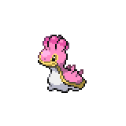

=== "Wild Encounters"

	???+ note "Grass Lv. 12-16"
		

                     [Slowpoke](/pokemon-umbral-stasis/pokemon/079-slowpoke) 20%
                

                     [Krabby](/pokemon-umbral-stasis/pokemon/098-krabby) 20%
                

                     [Wingull](/pokemon-umbral-stasis/pokemon/278-wingull) 20%
                

                     [Meditite](/pokemon-umbral-stasis/pokemon/307-meditite) 15%
                

                     [Shellos](/pokemon-umbral-stasis/pokemon/422-shellos) 15%
                

                     [Croagunk](/pokemon-umbral-stasis/pokemon/453-croagunk) 10%
                

