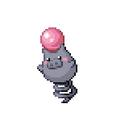

=== "Wild Encounters"

	???+ note "Grass Lv. 8-13"
		

                     [Spearow](/pokemon-umbral-stasis/pokemon/021-spearow) 25%
                

                     [Jigglypuff](/pokemon-umbral-stasis/pokemon/039-jigglypuff) 25%
                

                     [Lillipup](/pokemon-umbral-stasis/pokemon/522-lillipup) 17%
                

                     [Abra](/pokemon-umbral-stasis/pokemon/063-abra) 13%
                

                     [Shinx](/pokemon-umbral-stasis/pokemon/406-shinx) 10%
                

                     [Spoink](/pokemon-umbral-stasis/pokemon/325-spoink) 5%
                

