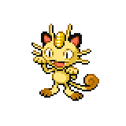
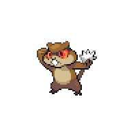

=== "Wild Encounters"

	???+ note "Grass Lv. 15-20"
		

                     [Skitty](/pokemon-umbral-stasis/pokemon/300-skitty) 21%
                

                     [Meowth](/pokemon-umbral-stasis/pokemon/052-meowth) 21%
                

                     [Hoppip](/pokemon-umbral-stasis/pokemon/187-hoppip) 21%
                

                     [Patrat](/pokemon-umbral-stasis/pokemon/504-patrat) 21%
                

                     [Tangela](/pokemon-umbral-stasis/pokemon/114-tangela) 11%
                

                     [Farfetchd](/pokemon-umbral-stasis/pokemon/083-farfetchd) 5%
                

