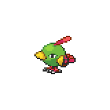
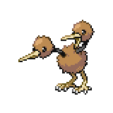
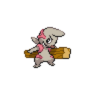
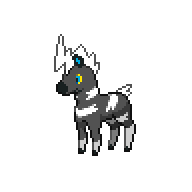
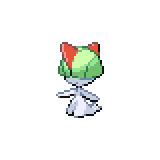

=== "Wild Encounters"

	???+ note "Grass Lv. 20-23"
		

                     [Natu](/pokemon-umbral-stasis/pokemon/177-natu) 20%
                

                     [Doduo](/pokemon-umbral-stasis/pokemon/084-doduo) 20%
                

                     [Mienfoo](/pokemon-umbral-stasis/pokemon/619-mienfoo) 20%
                

                     [Timburr](/pokemon-umbral-stasis/pokemon/532-timburr) 15%
                

                     [Rhyhorn](/pokemon-umbral-stasis/pokemon/111-rhyhorn) 10%
                

                     [Blitzle](/pokemon-umbral-stasis/pokemon/522-blitzle) 10%
                

                     [Ralts](/pokemon-umbral-stasis/pokemon/280-ralts) 5%
                

